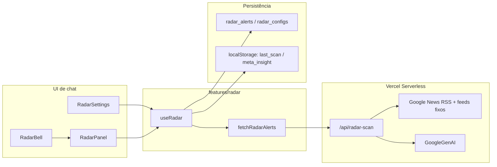

O Radar roda como boundary de feature em `features/radar`, com estado e orquestração no hook `useRadar`, cliente HTTP em `fetchRadarAlerts` e execução serverless em `/api/radar-scan`. A UI ainda vive em `components/RadarPanel.tsx`, `components/RadarSettings.tsx` e `components/RadarBell.tsx`, carregados sob demanda pelo shell de chat.

## Superfície principal

| Área            | Implementação                                   | Responsabilidade                                                                                          |
| --------------- | ----------------------------------------------- | --------------------------------------------------------------------------------------------------------- |
| Estado do Radar | `features/radar/useRadar.ts`                    | Configuração, scan manual/automático, deduplicação contra histórico, leitura/não lido e persistência      |
| Cliente HTTP    | `features/radar/service.ts`                     | `POST /api/radar-scan`, timeout de 25s, parsing de resposta e mapeamento de erros recuperáveis            |
| Endpoint        | `api/radar-scan.ts`                             | Busca RSS/Google News, resumo/classificação com Gemini, deduplicação entre categorias e resposta agregada |
| Tipos           | `types.ts` via `features/radar/types.ts`        | `RadarCategory`, `RadarAlert`, `RadarConfig`, UFs e labels                                                |
| Compatibilidade | `hooks/useRadar.ts`, `services/radarService.ts` | Facades legadas; código novo deve importar de `features/radar`                                            |

<Note>
Os comentários antigos ainda citam IDB em alguns pontos, mas a configuração e os alertas atuais passam pelo barrel `services/storage` e usam Supabase quando disponível. `lastScanAt` e `metaInsight` ficam em `localStorage`.
</Note>

## Configuração do operador

`RadarSettings` controla quatro campos de `RadarConfig`:

| Campo               | Tipo              | Padrão  | Comportamento                                                                    |
| ------------------- | ----------------- | ------- | -------------------------------------------------------------------------------- |
| `enabled`           | `boolean`         | `false` | Liga ou desliga a varredura automática.                                          |
| `isConfigured`      | `boolean`         | `false` | Só vira `true` ao salvar com pelo menos uma categoria.                           |
| `categories`        | `RadarCategory[]` | `[]`    | Define os temas monitorados. Sem categoria, o botão de salvar fica desabilitado. |
| `estados`           | `string[]`        | `[]`    | Lista de UFs. Vazio significa Brasil todo.                                       |
| `scanIntervalHours` | `number`          | `12`    | Intervalo do auto-scan. A UI oferece `6`, `8`, `12` e `24`.                      |

Categorias aceitas:

| Valor          | Label na UI              |
| -------------- | ------------------------ |
| `concorrentes` | Radar da Concorrência    |
| `regulatorio`  | Regulatório & Compliance |
| `mercado`      | Mercado & Commodities    |
| `ma_expansao`  | M&A & Expansão           |
| `agro_tech`    | Inovação & AgTech        |
| `rh_trabalho`  | RH & Trabalhista         |

A UI restringe estados à lista `BRASIL_UFS`. O endpoint valida apenas strings de 2 caracteres e no máximo 27 itens.

## Ciclo de varredura



O hook carrega alertas e configuração ao inicializar. Se Supabase estiver indisponível, a leitura retorna valores vazios e a UI continua com defaults.

A varredura manual chama `forceScan()`. Se `isConfigured` for `false`, o hook define `lastError` com `RADAR_BAD_REQUEST` e não chama a API. Quando configurado, `forceScan()` executa mesmo se `enabled` estiver `false`.

A varredura automática roda somente quando `enabled`, `isConfigured` e `isInitialized` são verdadeiros. O hook compara `Date.now()` com `lastScanAt` e reavalia a cada 1 hora.

Durante `runScan()`, o hook usa um lock (`scanLockRef`) para evitar chamadas concorrentes, limpa erro/aviso anterior, marca `isScanning=true`, chama `fetchRadarAlerts(config)`, persiste o timestamp e mescla alertas novos.

## Deduplicação e limite de histórico

O Radar deduplica em mais de uma camada:

| Camada       | Regra                                                                                                                        |
| ------------ | ---------------------------------------------------------------------------------------------------------------------------- |
| Endpoint     | Remove duplicatas entre categorias por título normalizado, sem acentos, sem pontuação e truncado em 80 caracteres.           |
| Gemini batch | Antes de resumir, reduz itens por chave de título em lower-case truncada em 60 caracteres.                                   |
| Hook         | Rejeita alerta novo se o `id` já existir ou se o título tiver similaridade Jaccard de bigramas `>= 0.55` contra o histórico. |

O hook mantém no máximo `100` alertas, sempre inserindo os novos no início. `unreadCount` é calculado por `alerts.filter(a => !a.read).length`.

## Contrato de `/api/radar-scan`

| Método                 | Uso                                                                                                    |
| ---------------------- | ------------------------------------------------------------------------------------------------------ |
| `POST /api/radar-scan` | Caminho usado pelo frontend. Recebe categorias e UFs.                                                  |
| `GET /api/radar-scan`  | Existe no handler e executa todas as categorias com `estados: []`; não é o caminho usado pelo cliente. |

:::endpoint POST /api/radar-scan Executa uma varredura do Radar

<RequestExample>

```bash
curl -X POST "$APP_URL/api/radar-scan" \
  -H "Content-Type: application/json" \
  -d '{
    "categories": ["concorrentes", "mercado"],
    "estados": ["MT", "MS"]
  }'
```

</RequestExample>

<ParamField body="categories" type="RadarCategory[]" required>
Array com 1 a 6 categorias. Valores aceitos: `concorrentes`, `regulatorio`, `mercado`, `ma_expansao`, `agro_tech`, `rh_trabalho`.
</ParamField>

<ParamField body="estados" type="string[]">
Array opcional de UFs com 2 caracteres e no máximo 27 itens. O default no endpoint é `[]`.
</ParamField>

<ResponseField name="alerts" type="RadarAlert[]">
Alertas classificados. Cada item inclui `id`, `title`, `summary`, `sourceUrl`, `sourceName`, `category`, `relevance`, `publishedAt`, `scannedAt`, `read` e, quando disponível, `impacto`, `estagio` e `estado`.
</ResponseField>

<ResponseField name="metaInsight" type="string | null">
Síntese estratégica curta gerada quando há alertas após deduplicação.
</ResponseField>

<ResponseField name="scannedAt" type="string">
Timestamp ISO da execução no serverless.
</ResponseField>

<ResponseField name="partialFailures" type="{ category: string; reason: string }[]">
Categorias que falharam enquanto outras categorias puderam retornar resultado.
</ResponseField>

<ResponseField name="categoryStats" type="{ category: string; sourceItems: number; generatedAlerts: number; ok: boolean }[]">
Resumo por categoria com total de itens RSS encontrados, alertas gerados e status.
</ResponseField>

<ResponseExample>

```json
{
  "alerts": [
    {
      "id": "radar_abc123",
      "title": "Título da notícia",
      "summary": "Resumo do impacto em texto puro.",
      "sourceUrl": "https://exemplo.com/noticia",
      "sourceName": "Portal",
      "category": "mercado",
      "relevance": "alta",
      "impacto": "oportunidade",
      "estagio": "fato_consumado",
      "publishedAt": "2026-06-08",
      "scannedAt": "2026-06-08T12:00:00.000Z",
      "estado": "MT",
      "read": false
    }
  ],
  "metaInsight": "Pressão logística e novos movimentos competitivos elevam prioridade comercial no Centro-Oeste.",
  "scannedAt": "2026-06-08T12:00:00.000Z",
  "partialFailures": [],
  "categoryStats": [
    {
      "category": "mercado",
      "sourceItems": 18,
      "generatedAlerts": 5,
      "ok": true
    }
  ]
}
```

</ResponseExample>

:::

## Fontes e classificação

O endpoint busca itens em Google News RSS por queries de categoria e em feeds fixos como Canal Rural, Notícias Agrícolas, Agrolink, TI Inside, InfoMoney, Globo Rural e Valor Agro.

A etapa Gemini não usa ferramenta de busca: ela recebe os artigos coletados, seleciona até 5 relevantes por categoria, exige texto puro no resumo e produz campos como `RELEVANCIA`, `IMPACTO`, `ESTAGIO`, `DATA` e `ESTADO`. Se a chamada Gemini falhar em uma categoria, o endpoint usa fallback com até 5 itens RSS crus, relevância `media` e resumo do feed.

<Warning>
O frontend aborta a chamada a `/api/radar-scan` após 25 segundos. A função Vercel está configurada com `maxDuration` de 120 segundos, mas esse limite maior não impede o cliente de mostrar `RADAR_TIMEOUT`.
</Warning>

## Persistência

Alertas e configuração usam `services/storage/radar.ts`:

| Dado         | Destino  | Chave/tabela                                  |
| ------------ | -------- | --------------------------------------------- |
| Alertas      | Supabase | `radar_alerts.alert_data`, com `operator_id`  |
| Configuração | Supabase | `radar_configs.config`, com `operator_id`     |
| Último scan  | Browser  | `localStorage["scout360:radar_last_scan"]`    |
| Meta insight | Browser  | `localStorage["scout360:radar_meta_insight"]` |

Quando `VITE_SUPABASE_URL` ou `VITE_SUPABASE_ANON_KEY` não existem, `isSupabaseAvailable()` retorna `false`. Nesse caso, leituras de Radar retornam `[]` ou `null`, gravações viram no-op e a UI continua funcional sem persistência remota de alertas/configuração.

## Erros recuperáveis

`fetchRadarAlerts` converte falhas HTTP/rede em `RadarScanError` com `code`, `userMessage` e `retryable`.

| Código              | Origem                                  | Recuperável | Efeito esperado                                             |
| ------------------- | --------------------------------------- | ----------- | ----------------------------------------------------------- |
| `RADAR_TIMEOUT`     | Abort do frontend após 25s              | Sim         | UI mostra mensagem para tentar de novo.                     |
| `RADAR_NETWORK`     | Falha de conexão/fetch                  | Sim         | UI mostra falha de conexão.                                 |
| `RADAR_BAD_REQUEST` | `400` ou `forceScan()` sem configuração | Não         | Operador deve revisar categorias/UFs ou configurar o Radar. |
| `RADAR_RATE_LIMIT`  | `429` retornado por plataforma/proxy    | Sim         | Operador tenta novamente depois.                            |
| `RADAR_SERVER`      | `5xx`                                   | Sim         | UI mostra instabilidade temporária.                         |
| `RADAR_UNKNOWN`     | Status inesperado                       | Sim         | UI mostra falha genérica.                                   |

O painel exibe `scanWarning` para varreduras parciais e `scanError` para falhas controladas. Quando `retryable` é verdadeiro, aparece a ação “Tentar novamente”.

## Estados visuais

| Estado                         | Condição                                           | UI                                                              |
| ------------------------------ | -------------------------------------------------- | --------------------------------------------------------------- |
| Não configurado                | `config.isConfigured === false`                    | Painel pede seleção de categorias/estados e abre configurações. |
| Varrendo sem alertas filtrados | `isScanning && filtered.length === 0`              | Loader com texto “Buscando notícias do setor...”.               |
| Sem resultados                 | Configurado, sem scan ativo e lista filtrada vazia | Mensagem “Nenhum alerta encontrado”.                            |
| Com alertas                    | `filtered.length > 0`                              | Cards por categoria, relevância, impacto, estágio, UF e fonte.  |
| Varredura parcial              | `lastWarning` preenchido                           | Callout âmbar no header do painel.                              |
| Erro controlado                | `lastError` preenchido                             | Callout vermelho com código e retry quando aplicável.           |

Abrir um alerta marca o item como lido e tenta abrir `sourceUrl` em nova aba quando a URL não é `#`. O botão de descartar remove o alerta da lista local.

## Integração com o chat

`App.tsx` instancia `useRadar(toast)` e repassa o objeto para `ChatInterface`. O shell renderiza `RadarBell` no header. `ChatPanels` renderiza `RadarPanel` e `RadarSettings` por lazy loading.

Quando existem alertas ou `metaInsight`, `ChatInterface` inclui um bloco oculto `<radar_context>` no prompt de investigação com status de configuração, total de não lidos, warning/error e até 3 alertas principais. Esse contexto também pode ativar o bloco de orçamento comercial em modos que normalmente não o incluiriam.

## Operação e validação

Use os testes focados abaixo ao alterar Radar:

```bash
npm exec vitest run tests/hooks/useRadar.test.ts tests/services/radarService.test.ts tests/services/storage.test.ts tests/architecture/radarBoundaryImportGuard.test.ts
```

Use `npm run typecheck` para validar contratos TypeScript. Se a mudança tocar UI do painel, incluir testes de componentes relacionados, especialmente os que cobrem warning/error e ações de retry.

Checklist de mudança segura:

<Steps>
  <Step title="Preserve o boundary">
    Código novo de produção deve importar Radar por `features/radar`. As facades `hooks/useRadar.ts` e `services/radarService.ts` existem só por compatibilidade.
  </Step>
  <Step title="Atualize tipos centrais">
    Novas categorias exigem atualização em `types.ts`, labels/ícones/cores, `VALID_CATEGORIES`, queries do endpoint e testes de prompt/cliente.
  </Step>
  <Step title="Mantenha erro recuperável explícito">
    Falhas esperadas devem virar `RadarScanError` no cliente ou `partialFailures` no endpoint, não exceção silenciosa.
  </Step>
  <Step title="Valide persistência">
    Teste leitura/gravação de `radar_alerts` e `radar_configs` via `services/storage`, incluindo Supabase indisponível.
  </Step>
</Steps>

## Troubleshooting

| Sintoma                                  | Verificação                                                                                                                          |
| ---------------------------------------- | ------------------------------------------------------------------------------------------------------------------------------------ |
| `Missing GEMINI_API_KEY`                 | Configure `GEMINI_API_KEY` no ambiente serverless. Não use prefixo `VITE_` para essa chave.                                          |
| `RADAR_BAD_REQUEST`                      | Confirme que há 1 a 6 categorias e UFs de 2 caracteres.                                                                              |
| Timeout no frontend                      | A chamada passou de 25s no cliente. Reduza categorias ou tente novamente; a function tem limite maior, mas a UI aborta antes.        |
| Painel mostra varredura parcial          | Inspecione `partialFailures` e `categoryStats` para identificar a categoria sem fonte ou com erro.                                   |
| Alertas/configuração somem entre sessões | Verifique `VITE_SUPABASE_URL`, `VITE_SUPABASE_ANON_KEY` e existência de `operator_id`; sem Supabase, gravações remotas são no-op.    |
| Resposta 200 sem alertas                 | Pode não haver itens RSS relevantes, o Gemini pode retornar `NENHUM_RESULTADO`, ou a deduplicação pode ter removido itens repetidos. |

## Related pages

<CardGroup>
  <Card title="Configurar Supabase" href="/configurar-supabase">
    Variáveis, tabelas críticas e degradação quando a persistência remota está indisponível.
  </Card>
  <Card title="Referência de APIs serverless" href="/api-serverless-reference">
    Padrões de métodos, validação, erros e limites das rotas em `api/*.ts`.
  </Card>
  <Card title="Arquitetura do app" href="/arquitetura-app">
    Providers, boundaries de feature e fachadas públicas preservadas.
  </Card>
  <Card title="Testes e gates" href="/testes-gates">
    Comandos npm, Vitest, contratos e critérios de validação por tipo de mudança.
  </Card>
</CardGroup>

## Source files

- `features/radar/README.md`
- `features/radar/useRadar.ts`
- `features/radar/service.ts`
- `api/radar-scan.ts`
- `components/RadarPanel.tsx`
- `components/RadarSettings.tsx`
- `tests/hooks/useRadar.test.ts`
