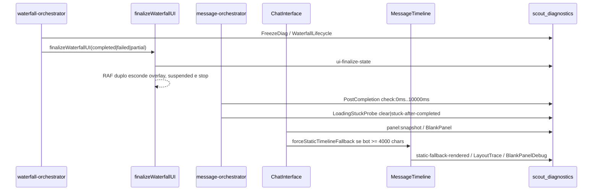

O painel branco no Senior Scout 360 é tratado como falha de handoff visual pós-waterfall: o dossiê pode ter sido gerado e persistido, mas o `chat-main-panel` ainda não mostra `bot-message-content` visível, mantém overlay/placeholder preso ou monta `messages-static-fallback` com `display:none`.

<Warning>
O estado atual do incidente é mitigado, não encerrado por causa raiz: a safety net `static-fallback-display-recovery` recupera `messages-static-fallback` quando o elemento aparece com `display:none`, mas a origem desse estilo ainda não foi identificada.
</Warning>

## Superfície técnica

| Área                     | Identificadores principais                                                                           | Uso na investigação                                                            |
| ------------------------ | ---------------------------------------------------------------------------------------------------- | ------------------------------------------------------------------------------ |
| Diagnóstico persistente  | `scoutDiag`, `recordDiagnostics`, `scout_diagnostics`                                                | Linha do tempo por `sessionId`, `area`, `event`, `payload`                     |
| Finalização do waterfall | `finalizeWaterfallUI`, `WaterfallLifecycle/ui-finalized`, `ui-finalize-post-render`                  | Confirma se loading, overlay, stop button e composer foram liberados           |
| Pós-finalização          | `PostCompletion/check:*`, `LoadingStuckProbe`                                                        | Mede DOM real em `0`, `100`, `500`, `1000`, `3000` e `10000` ms                |
| Detecção de branco       | `BlankPanel/blank-panel-detected`, `collectBlankPanelSnapshot`                                       | Classifica ausência de linhas, bot invisível, placeholder ou viewport suspensa |
| Layout                   | `LayoutTrace`, `BlankPanelDebug`, `traceFullAncestorChain`                                           | Captura `display`, dimensões, overflow e ancestrais suspeitos                  |
| Fallback visual          | `messages-static-fallback`, `static-timeline-fallback-activated`, `static-fallback-display-recovery` | Força timeline estática para dossiês grandes e recupera `display:none`         |
| Validação E2E            | `tests-e2e/scheffer-cnpj-blank-panel.spec.ts`                                                        | Garante overlay fora, painel visível, bot visível e texto mínimo               |

## Pré-condições de diagnóstico

Ative a telemetria antes de tentar reproduzir o travamento. O frontend só persiste eventos quando `VITE_SCOUT_DIAGNOSTICS_ENABLED=true` ou quando o navegador tem `SCOUT_DIAG_ENABLED=1`.

<CodeGroup>

```js title="DevTools do preview ou produção"
localStorage.setItem('SCOUT_DIAG_ENABLED', '1');
location.reload();
```

```bash title="Ambiente com logs verbosos"
VITE_SCOUT_DIAGNOSTICS_ENABLED=true
VITE_VERBOSE_LOGS=true
VITE_DEBUG_CONSOLE=true
```

</CodeGroup>

<Note>
`warn` e `error` sempre aparecem. `info` depende de DEV ou `VITE_VERBOSE_LOGS=true`; `debug` depende de DEV ou `VITE_DEBUG_CONSOLE=true`.
</Note>

## Fluxo esperado pós-waterfall



A sessão saudável tem `FreezeDiag`, `WaterfallLifecycle/ui-finalized`, `PostCompletion` com seis checks, `check:10000ms` presente, nenhum `blank-panel-detected` persistente e `bot-message-content` visível dentro de `chat-main-panel`.

## Procedimento

<Steps>

<Step title="Colete os IDs da sessão">
Registre `sessionId`, `waterfallRunId`, hostname do preview/produção, horário aproximado, CNPJ usado e se o operador viu overlay, painel vazio, placeholder ou bot invisível. Sem `sessionId`, a investigação perde a linha do tempo persistida.
</Step>

<Step title="Monte a linha do tempo no Supabase">
Consulte `scout_diagnostics` em ordem cronológica. Priorize `PostCompletion`, `WaterfallLifecycle`, `FreezeDiag`, `BlankPanel`, `BlankPanelDebug`, `LayoutTrace`, `LoadingStuckProbe`, `SpinnerStuck`, `Virtuoso` e `MessageRow`.

```sql title="Linha do tempo por sessão"
select created_at, area, event, severity, payload
from scout_diagnostics
where session_id = '<session-id>'
order by created_at asc;
```

</Step>

<Step title="Compare marcadores obrigatórios">
Use agregados para separar freeze de backend, handoff de UI e falha de layout.

```sql title="Resumo de marcadores"
select
  count(*) filter (where area = 'FreezeDiag') as freeze_diag,
  count(*) filter (where area = 'WaterfallLifecycle' and event = 'ui-finalized') as ui_finalized,
  count(*) filter (where area = 'PostCompletion') as post_completion,
  count(*) filter (where area = 'PostCompletion' and event = 'check:10000ms') as post_completion_10s,
  count(*) filter (where area in ('BlankPanel', 'SpinnerStuck', 'LoadingStuckProbe')) as stuck_or_blank
from scout_diagnostics
where session_id = '<session-id>';
```

</Step>

<Step title="Classifique a assinatura">
Use a tabela de assinaturas abaixo. Não pule direto para CSS: primeiro confirme se o waterfall terminou, se a UI foi finalizada e se o DOM real pós-render ficou coerente.
</Step>

<Step title="Feche com validação visual">
A correção só está validada quando o overlay sai, o composer volta, `messages-viewport-placeholder` e `messages-viewport-suspended` somem, e o último `bot-message-content` fica visível com texto de dossiê.
</Step>

</Steps>

## Assinaturas de falha

| Assinatura                                 | Evidência típica                                                                                                 | Interpretação                                                                             |
| ------------------------------------------ | ---------------------------------------------------------------------------------------------------------------- | ----------------------------------------------------------------------------------------- |
| `PostCompletion=0` com waterfall concluído | `WaterfallLifecycle` ou health-check terminal existe, mas não há `PostCompletion/check:*`                        | Finalização, flush ou main thread impediram probes pós-render                             |
| `check:10000ms` ausente                    | Há checks iniciais, mas falta o check final                                                                      | Reabrir investigação se o waterfall terminou; o check de 10s é o marcador de estabilidade |
| Overlay travado                            | `LoadingStuckProbe/stuck-after-completed`, `SpinnerStuck/overlay-persisted-post-waterfall`, `domHasOverlay=true` | Store e DOM divergiram ou cleanup de overlay não aplicou                                  |
| Composer preso                             | `domComposerDisabled=true` em `ui-finalize-post-render` ou `LoadingStuckProbe`                                   | UI não voltou ao estado utilizável mesmo após `setIsLoading(false)`                       |
| Placeholder preso                          | `blankPanelReason=stuck-viewport-placeholder`                                                                    | Virtuoso/viewport ficou em estado intermediário pós-loading                               |
| Viewport suspensa presa                    | `blankPanelReason=stuck-viewport-suspended`                                                                      | Handoff ainda mostra suspensão apesar de bot esperado                                     |
| Bot não renderizado                        | `no-message-rows-in-panel`, `no-bot-nodes-in-panel`, `bot-nodes-have-no-visible-chars`                           | Painel existe, mas não há conteúdo de bot visível                                         |
| Fallback estático invisível                | `BlankPanelDebug` com `quickCheck.fallback.display='none'`, `rectW=0`, `rectH=0`                                 | `messages-static-fallback` montou, mas CSS computado ocultou o elemento                   |
| Recovery acionado                          | `Virtuoso/static-fallback-display-recovery`                                                                      | Safety net recuperou o fallback; contar incidência antes de remover                       |
| Conteúdo invisível no commit               | `MessageRow/commit:invisible-bot-content` ou `commit:zero-dimension-ancestor`                                    | O nó do bot existe, mas dimensões/visibilidade impedem leitura visual                     |

## Critérios de reabertura

Reabra como incidente prioritário se qualquer condição aparecer em produção:

| Critério                                                       | Como medir                                                                                      |
| -------------------------------------------------------------- | ----------------------------------------------------------------------------------------------- |
| `static-fallback-display-recovery` acima de 5% das sessões     | Contagem de eventos `Virtuoso/static-fallback-display-recovery` sobre sessões com dossiê grande |
| `PostCompletion/check:10000ms` ausente com waterfall concluído | `WaterfallLifecycle/ui-finalized=1` e `PostCompletion/check:10000ms=0`                          |
| `domComposerDisabled=true` após `ui-finalize-post-render`      | Payload de `WaterfallLifecycle/ui-finalize-post-render`                                         |
| `blank-panel-detected` em mais de três checks consecutivos     | Eventos `BlankPanel` ou `PostCompletion/blank-panel-detected:*` na mesma sessão                 |

## Estados válidos e inválidos

`collectBlankPanelSnapshot` só deve acusar branco quando existe `sessionId`, há bot esperado, `isLoading=false`, a home inicial não está ativa e a lista não deveria estar suspensa.

| Estado visual                                  | Válido?          | Observação                                                                                                       |
| ---------------------------------------------- | ---------------- | ---------------------------------------------------------------------------------------------------------------- |
| `loadingOverlayVisible=true` durante loading   | Sim              | Overlay é esperado enquanto a geração está ativa                                                                 |
| `loadingOverlayVisible=true` após loading      | Não para produto | `BlankPanel` pode não marcar como branco, mas `isOverlayStuckPostWaterfall` e `LoadingStuckProbe` devem capturar |
| `controlledErrorVisible=true`                  | Sim              | Falha controlada deve renderizar card de erro e liberar input                                                    |
| `emptyStateVisible=true` sem sessão ativa      | Sim              | Estado inicial normal                                                                                            |
| `heroFallbackVisible=true` com loading exposto | Sim              | Evita painel vazio quando o overlay não cobre a timeline                                                         |
| `visibleBotWithCharsCount>0`                   | Sim              | Evidência mínima de dossiê visível                                                                               |
| `placeholderVisible=true` pós-waterfall        | Não              | Classifica `stuck-viewport-placeholder`                                                                          |
| `suspendedViewportVisible=true` pós-waterfall  | Não              | Classifica `stuck-viewport-suspended`                                                                            |
| `dossier-content` vazio                        | Não              | Não substitui `bot-message-content` visível com texto                                                            |

## Fallback estático

Dossiês com bot de pelo menos `4000` caracteres preferem timeline estática. O caminho primário é `ChatInterface` ativar `forceStaticTimelineFallback` ou `preferStaticForLargeDossier`; o caminho reativo é `BlankPanel/static-timeline-fallback-activated`.

Quando `MessageTimeline` renderiza `messages-static-fallback`, ele registra:

- `Virtuoso/static-fallback-rendered`
- `LayoutTrace/static-fallback-mount` para dossiê grande
- `BlankPanelDebug/probe:sync`, `probe:raf1`, `probe:raf2`, `probe:timeout50ms`, `probe:timeout500ms`
- `Virtuoso/static-fallback-display-recovery` se `getComputedStyle(el).display === 'none'`

A recovery limpa `el.style.display`; se o CSS computado continuar `none`, aplica `display: block !important`. Esse mecanismo é defensivo e não deve ser tratado como causa raiz fechada.

## Consultas úteis

```sql title="Sessões com PostCompletion ausente"
select session_id,
  count(*) filter (where area = 'WaterfallLifecycle' and event = 'ui-finalized') as ui_finalized,
  count(*) filter (where area = 'PostCompletion') as post_completion
from scout_diagnostics
where created_at > now() - interval '24 hours'
group by session_id
having count(*) filter (where area = 'WaterfallLifecycle' and event = 'ui-finalized') > 0
   and count(*) filter (where area = 'PostCompletion') = 0;
```

```sql title="Fallback recuperado por display:none"
select session_id, created_at, payload
from scout_diagnostics
where area = 'Virtuoso'
  and event = 'static-fallback-display-recovery'
order by created_at desc
limit 50;
```

```sql title="Composer preso após finalize"
select session_id, created_at, payload
from scout_diagnostics
where area = 'WaterfallLifecycle'
  and event = 'ui-finalize-post-render'
  and payload->>'domComposerDisabled' = 'true'
order by created_at desc;
```

```sql title="Blank panel por motivo"
select
  payload->>'reason' as reason,
  count(*) as total
from scout_diagnostics
where area = 'BlankPanel'
  and event = 'blank-panel-detected'
  and created_at > now() - interval '24 hours'
group by payload->>'reason'
order by total desc;
```

## Validação local e preview

Use o teste Scheffer como gate principal para o fluxo de CNPJ pós-waterfall.

```bash title="Gate focado"
npx playwright test tests-e2e/scheffer-cnpj-blank-panel.spec.ts
```

O teste executa o fluxo com CNPJ `04.733.767/0001-80`, valida empresa preenchida, envia Chapecó/SC, espera `loading-smart-overlay` aparecer e desaparecer, exige `chat-main-panel` visível, garante ausência de `messages-viewport-suspended` e `messages-viewport-placeholder`, e verifica o último `bot-message-content` com sentinela e `data-text-length` acima do mínimo.

Para fechamento de PR ou regressão visual ampla, rode também:

```bash title="Gates de regressão"
npm run typecheck
npm test
npm run build
npm run test:e2e:errors
npm run test:e2e:blank
```

<Check>
O critério final é visual e funcional: overlay fora, composer habilitado, painel com conteúdo do bot visível, placeholders ausentes e cards do dossiê renderizados. `PostCompletion` persistido ou `Virtuoso` montado não bastam sozinhos.
</Check>

## O que não reabrir sem nova evidência

- Hipótese de `display:none` causado apenas por flex colapsado: já foi refutada por reprodução mínima local.
- `deleteCachedContent` como causa direta do painel branco: hipótese descartada no handoff.
- Request pendente como explicação única: só vale se a timeline mostrar ausência de `ui-finalized` ou `PostCompletion`.
- RAF extra em `setIsLoading`: hipótese descartada para a regressão atual.
- Falha do composer como causa raiz primária: investigar apenas se `domComposerDisabled=true` persistir após `ui-finalize-post-render`.

## Related pages

<CardGroup>
  <Card title="Loading e estados visuais" href="/loading-estados-visuais">
    Contrato de overlay, timeline, fallback estático e estados válidos do painel.
  </Card>
  <Card title="Waterfall de dossiê" href="/dossie-waterfall">
    Pipeline modular, finalização de UI, timeouts e guard anti-restart.
  </Card>
  <Card title="Observabilidade e diagnósticos" href="/observabilidade">
    Sentry, `scoutDiag`, Supabase diagnostics, heartbeat e traces de layout.
  </Card>
  <Card title="Testes e gates" href="/testes-gates">
    Comandos Vitest, Playwright, E2E críticos e critérios por tipo de mudança.
  </Card>
</CardGroup>

## Source files

- `HANDOFF_AI.md`
- `utils/diagnosticLog.ts`
- `utils/blankPanelTelemetry.ts`
- `utils/layoutTraceTelemetry.ts`
- `features/chat/message-orchestrator.ts`
- `docs/handoffs/2026-06-08-pr346-p0-prod-preview-final.md`
- `tests-e2e/scheffer-cnpj-blank-panel.spec.ts`
