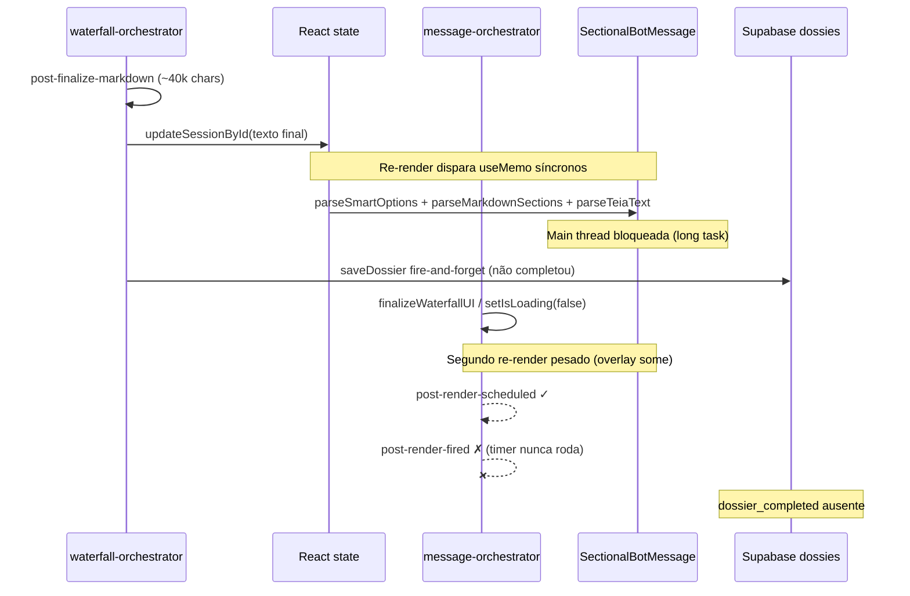

# BUG-7 — Freeze no render do dossiê final (cadeia causal)

**Data:** 2026-07-02  
**PR:** [#409](https://github.com/brunolimaff-jpg/NOVO-APP/pull/409)  
**Severidade:** 🔴 Crítica — bloqueia merge  
**Audiência:** gestão + engenharia  
**Relacionado:** [relatorio-rastreio-scheffer-pr409-2026-07-02.md](./relatorio-rastreio-scheffer-pr409-2026-07-02.md)

---

## Resumo para gestão

O Pipeline V2 **completa o backend** (7/7 na UI, texto final ~40k+ caracteres no console), mas a aplicação **congela** antes de exibir o dossiê e **não persiste** a sessão. O usuário perde o trabalho ao recarregar (F5). O fix parcial `b9c0e04e` não resolveu o caso Scheffer — é necessário **fix v2 modificado** (persistir antes do render + adiar todo parsing pesado + handoff estático).

---

## Cadeia causal confirmada

Ordem observada nas sessões Scheffer (`fb6f93d6`, `94f55d66`, `90e3fe7a`):

### Passo a passo

| # | Evento | O que acontece |
| - | ------ | -------------- |
| 1 | `post-finalize-markdown` | Waterfall conclui; texto final montado em memória (~40k Scheffer, ~56k em outras tentativas) |
| 2 | `updateSessionById` | Texto de ~40k chars entra no estado React da sessão — **primeiro gatilho de re-render pesado** |
| 3 | `useMemo` síncronos em `SectionalBotMessage` | `parseSmartOptions` → `parseMarkdownSections` → `parseTeiaText` → `filterSourcesForSection` — **tudo na main thread, antes do paint** |
| 4 | `saveDossier` fire-and-forget | Disparado **depois** do `updateSessionById`; não usa `await` no fluxo crítico — Supabase não recebe o dossiê a tempo |
| 5 | `finalizeWaterfallUI` + `setIsLoading(false)` | Overlay some; Virtuoso/static handoff tenta renderizar o markdown completo — **segundo pico de CPU** |
| 6 | Freeze | `post-render-scheduled` aparece; `post-render-fired` **nunca** aparece; `Interromper` não responde; snapshot Playwright timeout |

**Evidência chave:** o código em `message-orchestrator.ts` documenta explicitamente que `setIsLoading(false)` dispara render síncrono que bloqueia a thread, e que `setTimeout(0)` agendado depois não roda até o render terminar — mas o render **nunca termina** em dossiês grandes.

---

## Por que o fix `b9c0e04e` falhou

O commit `b9c0e04e` (deploy `dpl_8r7actvbtdVJr5PTMN5fzy37qF2x`) tentou:

1. `await saveDossier` antes de liberar a UI
2. `startTransition` em `SectionalBotMessage` para adiar o parse de markdown

**Por que não bastou para Scheffer:**

| Hipótese do fix v1 | Realidade observada |
| ------------------ | ------------------- |
| `await saveDossier` garante persistência | `saveDossier` ainda corre **depois** de `updateSessionById` — o estado React já tem 40k chars e o re-render já começou |
| `startTransition` adia parse pesado | `startTransition` **não torna `useMemo` assíncrono** — os `useMemo` em `SectionalBotMessage` rodam síncronos no render commit, independente de transition |
| Só `parseMarkdownSections` era o gargalo | `parseTeiaText` (14 CNPJs Scheffer), `parseSmartOptions`, `stripUnsafeSocietarySections` e `filterSourcesForSection` × N seções também são pesados |
| Overlay some = usuário vê dossiê | `setIsLoading(false)` dispara **outro** render completo antes de qualquer chunking |

**Conclusão:** mover save para `await` sem reordenar em relação ao `updateSessionById` não quebra a cadeia causal. Adiar só um parser via transition não cobre os demais `useMemo` síncronos.

---

## Fix v2 proposto vs fix v2 **modificado** (recomendado)

### Fix v2 proposto (baseline da análise)

1. Persistir sessão antes do primeiro paint do markdown pesado
2. Handoff estático / lazy chunks
3. Liberar overlay só após confirmação de save

### Fix v2 **modificado** (recomendação do reviewer)

| # | Ação | Detalhe |
| - | ---- | ------- |
| 1 | **`await saveDossier` ANTES de `updateSessionById` com texto final** | Garantir linha em `dossies` **antes** de colocar 40k chars no React state. Se F5 durante render, dossiê recuperável do Supabase. |
| 2 | **Adiar TODO parsing pesado** | Não só `parseMarkdownSections`: incluir `parseTeiaText`, `parseSmartOptions`, `filterSourcesForSection`. Opções: `useDeferredValue`, chunking via `scheduler.postTask` / `requestIdleCallback`, ou render inicial com placeholder estático. |
| 3 | **Alinhar com handoff estático existente** | Contrato em `docs/ai-context/refactor/loading-panel-contract.md` — regras R3/R5/R6: dossiê ≥4k chars deve usar timeline estática **no mesmo render**, não em `useEffect` pós-paint. |
| 4 | **Chunking fase 2 com fallback Safari** | Commit do texto do bot em fatias; Safari não tem `scheduler.postTask` — fallback para `requestAnimationFrame` + `setTimeout` com budget de ~16ms por frame. |
| 5 | **Um único ponto de save** | Eliminar duplicidade entre `saveDossier` no waterfall (fire-and-forget) e debounce de 1s em `useSessionStorage` — uma única chamada `await` no caminho crítico pós-waterfall. |

---

## Telemetria esperada pós-fix

| Evento | Antes (freeze) | Depois (OK) |
| ------ | -------------- | ----------- |
| `pre-save-dossier` | Ausente ou após updateSession | **Antes** de `messages-state-after-update` |
| `dossier_completed` / evento `dossier:completed` | ❌ Ausente | ✅ Presente |
| Linha em `dossies` (Supabase) | ❌ Ausente | ✅ Presente com `content` ~40k |
| `post-render-scheduled` | ✅ | ✅ |
| `post-render-fired` | ❌ Ausente | ✅ `delayMs` finito (<500ms típico) |
| `ui-finalized` / `PostCompletion` | ❌ Ausente | ✅ Presente |
| `post-render-fired` → flush diagnostics | ❌ Nunca roda | ✅ `processMessage:finally:after-flush` |
| Console: freeze / snapshot timeout | ❌ | ✅ Dossiê visível, botões clicáveis |

---

## Critérios de aceite — gate Scheffer

Validação manual obrigatória no preview Vercel da PR #409:

1. **Pipeline 7/7** — checklist completa sem travamento
2. **Dossiê visível** — texto renderizado, scroll funcional, `Interromper` some após conclusão
3. **`dossier_completed`** — evento em `operator_events` ou custom event no browser
4. **Persistência** — linha em `dossies` para o `sessionId` do run; F5 recupera o dossiê
5. **Telemetria completa** — `post-render-fired`, `PostCompletion`, sem heartbeat eterno com `bufferLen: 0`
6. **Smoke secundário** — Nutri Torta (~48k chars) sem freeze

Merge da PR #409 **somente** após gate Scheffer verde + palavra **MERGE** explícita do Bruno.

---

## BUG-8 — Freeze Chrome pós-persistência (fix v3)

**Data:** 2026-07-03  
**Relacionado:** [relatorio-rastreio-scheffer-pr409-2026-07-03.md](./relatorio-rastreio-scheffer-pr409-2026-07-03.md)

### Sintoma

Após fix v2 (`252b240d`), persistência e `post-render-fired` OK, mas operador ainda vê diálogo Chrome **"Página sem resposta"** (`domBodyLen` ~369k).

### Causa confirmada (SectionalBotMessage)

| # | Problema | Evidência |
| - | -------- | --------- |
| 1 | `computeParsedMessageBundle` rodava **síncrono** dentro de `scheduleIdleWork` | Callback idle não fragmenta long tasks |
| 2 | `initialCount` usava `TRUNCATION_SECTION_THRESHOLD` (3) | 3 seções markdown pesadas de uma vez |
| 3 | `MarkdownRenderer` import síncrono | react-markdown re-parse bloqueia main thread |

### Fix v3 (SectionalBotMessage)

1. `yieldToMain()` + `computeParsedMessageBundleChunked` — 3 fases com yield entre parse de seções, sources e teia
2. `CHUNKED_SECTIONS_PER_IDLE = 1`, `CHUNKED_INITIAL_SECTION_COUNT = 1`
3. `React.lazy(MarkdownRenderer)` + `Suspense` + `SectionSkeleton` por seção

### Gate UX pós-v3

Re-run Scheffer manual no preview Vercel — critério: sem "Página sem resposta" + dossiê scrollável.

---

## Fora de escopo deste bug

| Tema | Motivo |
| ---- | ------ |
| **IndexedDB / dívida de storage** | Não causa BUG-7 — `extractCache` roda no collector, não no render final. Ver [storage-debt-indexeddb-supabase.md](./storage-debt-indexeddb-supabase.md) |
| BUG-1 a BUG-6 | Cosméticos ou qualidade de fontes — backlog separado |
| Timeouts de módulo (Teia 86s, Operação 74s) | Pré-existentes — Fase 8, prioridade baixa |
| Refatorar Virtuoso / SocietaryMap | Follow-up de performance se long tasks persistirem após fix v2 |

---

## Arquivos no caminho crítico

| Arquivo | Papel na cadeia |
| ------- | --------------- |
| `features/dossier/waterfall-orchestrator.ts` | `updateSessionById` + `saveDossier` fire-and-forget |
| `features/chat/message-orchestrator.ts` | `setIsLoading(false)`, `post-render-scheduled` |
| `components/SectionalBotMessage.tsx` | `useMemo` síncronos de parse |
| `utils/sectionParser.ts` | `parseMarkdownSections` |
| `features/dossier/teiaTextParser.ts` | `parseTeiaText` |
| `utils/finalizeWaterfallUI.ts` | Libera overlay DOM |
| `components/ChatInterface.tsx` | Handoff estático (`preferStaticForLargeDossier`) |
| `hooks/useSessionStorage.ts` | Debounce 1s — segunda via de persistência |

---

## Referências

- [Relatório de rastreio Scheffer](./relatorio-rastreio-scheffer-pr409-2026-07-02.md)
- [Contrato loading/overlay](../ai-context/refactor/loading-panel-contract.md)
- [Validação complementar sessão 90e3fe7a](../relatorio-validacao-scheffer-pr409-2026-07-02.md)
- [Índice de bugs](./README.md)

---

*Documento gerado em 2026-07-02 — modo documentação, sem alteração de código.*
---

## Fix v4 (BUG-8) — 2026-07-02

**Commit:** (pendente)  
**Problema:** Fix v3 (`e8e50a2a`) ainda congelava — diálogo Chrome "Página sem resposta", `domBodyLen` ~432k.

**Causa:** parsing síncrono antes do primeiro yield; `applyDossierLinkIntegrity`/`buildAuditableSources` no `useMemo` do MessageRow; static-fallback proativo montava HTML completo com overlay ainda no DOM.

**Mudanças v4:**
1. `finalizeWaterfallUI` + `yieldBeforeHandoff` **antes** de `updateSessionById` (purgar LoadingSmart)
2. Desabilitar `preferStaticForLargeDossier` proativo — Virtuoso + seções incrementais
3. `shouldApplyProactiveForceStatic` bloqueado enquanto `isLoading`
4. Parsing com yield **antes** de cada etapa + telemetria `chunked-parse:start|yield|complete`
5. Escape hatch 3s → markdown bruto sem skeleton eterno
6. `MessageRow`: auditable sources adiados via `requestIdleCallback` para texto >4K

**Gate:** novo run Scheffer manual no preview Vercel — meta `domBodyLen` <100k, sem diálogo Chrome.

