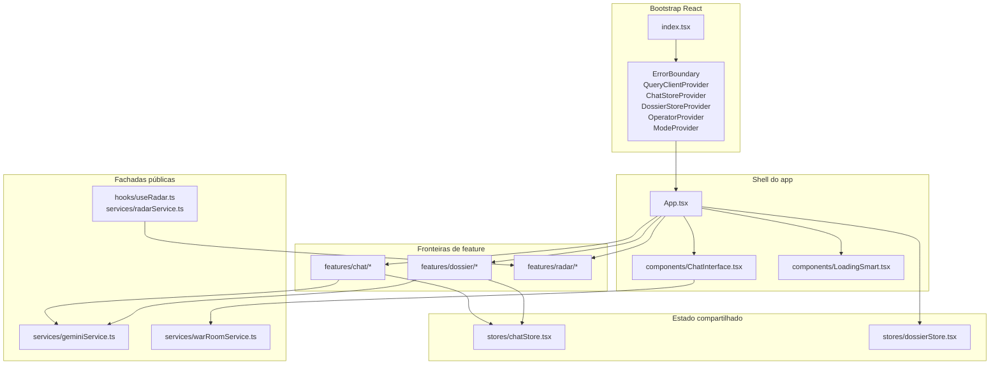

---
title: "Arquitetura do app"
description: "Bootstrap React, providers globais, stores, orquestrador principal, fronteiras de features e fachadas públicas preservadas."
---

O app é uma SPA React 19 + TypeScript + Vite montada por `index.tsx`, com `App.tsx` ainda atuando como orquestrador principal entre shell de chat, stores globais, waterfall de dossiê, Radar, modais, loading e fachadas de serviços.

## Mapa de runtime



## Bootstrap React

`index.tsx` executa a montagem global do app e deve permanecer como ponto único de boot.

| Área | Comportamento atual |
| --- | --- |
| Observabilidade | Inicializa Sentry quando `VITE_SENTRY_DSN` existe, com release derivado de `VITE_SENTRY_RELEASE`, `VITE_APP_VERSION` ou `VITE_VERCEL_GIT_COMMIT_SHA`. |
| Ambiente | `REQUIRED_ENV_VARS` está vazio no boot atual; `VITE_BACKEND_URL` é opcional e gera warning em DEV quando ausente. |
| React Query | Cria `QueryClient` com `staleTime` de 5 minutos, `retry: 2` e `refetchOnWindowFocus: false`. |
| Cache antigo | Remove Service Workers e caches quando a janela não está em modo standalone. |
| Diagnóstico global | Registra listeners de `error` e `unhandledrejection`, faz flush imediato dos diagnósticos, instala visibility tracking e heartbeat. |

A árvore de providers é fixa:

```text
ErrorBoundary
└─ QueryClientProvider
   └─ ChatStoreProvider
      └─ DossierStoreProvider
         └─ OperatorProvider
            └─ ModeProvider
               └─ App
```

<Note>
O código de aplicação fica na raiz do repositório (`App.tsx`, `components/`, `features/`, `stores/`, `services/`, `api/`). Não assuma diretório `src/`.
</Note>

## Providers globais

### `ChatStoreProvider`

`stores/chatStore.tsx` concentra sessão, mensagens, paginação, loading e refs operacionais do chat.

Campos principais:

| Campo | Uso |
| --- | --- |
| `sessions` / `setSessions` | Lista de `ChatSession` carregada por `useSessionStorage`. |
| `sessionsRef` | Ref sincronizado no render para evitar stale state durante waterfall e batching do React. |
| `currentSessionId` / `currentSession` | Seleção ativa da conversa. |
| `allMessages` | Mensagens da sessão atual, com fallback para array vazio. |
| `visibleCount` | Paginação da timeline; `PAGE_SIZE` é `20`. |
| `lastQuery` | Texto sanitizado usado por loading e contexto visual. |
| `lastActionRef` | Última ação reexecutável: envio ou regeneração de sugestões. |
| `abortControllerRef` | Abort atual da geração. |
| `activeGenerationRef` | Bot message ativo por sessão, usado para impedir concorrência. |
| `isLoading`, `loadingStatus`, `loadingVariant` | Estado compartilhado do loading via `useChatLoadingProgress`. |

O store expõe `updateSessionById` e `updateCurrentSession`; ambos preservam `updatedAt` na alteração de sessão. Ele também registra warnings quando mensagens desaparecem ou quando há geração ativa sem `currentSession`.

### `DossierStoreProvider`

`stores/dossierStore.tsx` é menor e guarda estados derivados de dossiê/exportação:

| Campo | Valores |
| --- | --- |
| `exportStatus` | `idle`, `loading`, `success`, `error` |
| `exportError` | Mensagem de erro de exportação ou `null` |
| `pdfReportContent` | Conteúdo derivado para relatório |
| `isSavingRemote` | Estado de save remoto |
| `remoteSaveStatus` | `idle`, `success`, `error` |

### `OperatorProvider`

`contexts/OperatorContext.tsx` mantém operador local-only no browser: `operatorId`, `name` e `email`. O provider gera `operatorId` com prefixo `op_`, persiste nome/e-mail em storage local, faz sync best-effort em `storage.saveUserContext`, inicializa tracking de sessão e dispara `operator-relinked` quando um operador existente é vinculado.

### `ModeProvider`

`contexts/ModeContext.tsx` força `DEFAULT_MODE` e expõe `systemInstruction` a partir de `OPERACAO_PROMPT`. `setMode` e `toggleMode` preservam o modo único de investigação; não há runtime ativo de múltiplos modos no app atual.

## `App.tsx` como orquestrador principal

`App.tsx` ainda faz a cola entre domínio, UI e handlers, mas delega responsabilidades para hooks e feature boundaries.

Responsabilidades diretas:

| Responsabilidade | Implementação |
| --- | --- |
| Inicialização | `useAppInitialization` faz warm-up do lookup, carrega sessões, mescla sessões locais criadas durante o load e seleciona a primeira sessão apenas se nenhuma estiver ativa. |
| Chat | `useSessionManager`, `useSessionRemoteSave`, `useChatFeedbackActions` e `useChatMessageOrchestrator`. |
| Dossiê | `useDossierWaterfallOrchestrator`, `DossierErrorBoundary` e overlay `LoadingSmart`. |
| Radar | `useRadar` importado pelo barrel `features/radar`. |
| Shell visual | Renderiza `ChatInterface` com sessão atual, mensagens paginadas, handlers, estados de exportação, save remoto, flags de acesso e props de Radar. |
| Modais | `EmailModal`, `FollowUpModal` e `UpdateNotificationModal` via `React.lazy` e `loadWithChunkRetry`. |
| Observabilidade visual | Logs de decisão do overlay, cleanup de Service Worker/cache e build-info no mount. |

`App.tsx` calcula `showFullscreenLoadingSmart` a partir de `isLoading`, `loadingVariant` e existência de mensagem de bot renderizável. Quando `isLoading=false`, existe uma invariante defensiva: se `[data-testid="loading-smart-overlay"]` ainda estiver no DOM, o app registra erro e força `display:none`.

## Fluxo principal de mensagem

O envio de mensagem passa por `features/chat/message-orchestrator.ts`.

```text
ChatInterface.onSendMessage
  -> useChatMessageOrchestrator.handleSendMessage
  -> cria sessão se necessário
  -> adiciona Message do usuário
  -> processMessage
     -> bloqueia geração duplicada por sessão
     -> bloqueia se há waterfall global ativo
     -> cria placeholder de bot
     -> roteia:
        - "DOSSIE COMPLETO" + requestKind != deep_dive -> runMegaPromptWaterfall
        - demais mensagens -> sendMessageToGemini via services/geminiService.ts
     -> atualiza Message final com texto, fontes, sugestões, Score PORTA e dados Senior
     -> finaliza loading, flush de diagnóstico e probes pós-render
```

`processMessage` mantém três contratos importantes:

| Contrato | Efeito |
| --- | --- |
| Concorrência | `activeGenerationRef` impede duas gerações simultâneas na mesma sessão. `isAnyWaterfallActive()` impede dois waterfalls globais. |
| Abort | `AbortController` é guardado em `abortControllerRef`; abort remove placeholder vazio e encerra loading. |
| Erro controlado | Falha não-abort gera `Message` de bot com `isError: true` e `errorDetails` normalizado. |

Após o `finally`, o orquestrador zera `isLoading`, limpa `loadingVariant`, completa progresso, reseta `requestKind`, limpa label fixo, agenda `PostCompletion` checks e `LoadingStuckProbe` para validar DOM, overlay, composer e bot content.

## Waterfall de dossiê

`features/dossier/waterfall-orchestrator.ts` é chamado pelo orquestrador de mensagem quando a entrada normalizada contém `DOSSIE COMPLETO` e não é `deep_dive`.

O hook usa dependências explícitas quando fornecidas ou cai no `ChatStore` via `useMaybeChatStore`. As dependências obrigatórias incluem `resolvedOperatorName`, `updateSessionById`, funções de loading e `setFailureCount`.

Módulos atuais do waterfall:

| Módulo | Obrigatório | Timeout |
| --- | --- | --- |
| `Porte / Teia Societária` | Sim | `90000ms` |
| `Operação / Cadeia de Valor` | Sim | `90000ms` |
| `Bordas de Controle` | Não | `60000ms` |
| `Riscos & Compliance` | Não | `60000ms` |
| `Caminho de Venda` | Não | `60000ms` |

O pipeline usa `registerWaterfallStart` e `registerWaterfallEnd` como guard anti-restart. Ao final, registra health-check com sessão, mensagem de bot, overlay, composer e persistência, então chama `finalizeWaterfallUI` para limpar loading, variant, progresso, failure count, geração ativa, abort controller e overlay DOM.

<Warning>
`App.tsx` não deve receber novos detalhes internos do waterfall. Novas etapas de dossiê entram em `features/dossier/*`; utilitários compartilhados devem ir para `utils/` ou uma fronteira compartilhada, não para `features/chat/*`.
</Warning>

## Fronteiras de features

| Fronteira | Dono atual | Regra prática |
| --- | --- | --- |
| `features/chat/*` | Sessão, envio, feedback, loading progress e error boundary do chat | Pode depender de `stores/chatStore.tsx` e `services/geminiService.ts`; não deve reintroduzir `hooks/useChat.ts`. |
| `features/dossier/*` | Waterfall, benchmark e reconciliação PORTA | Não deve importar internos de `features/chat/*`. |
| `features/radar/*` | Runtime do Radar, persistência, scan orchestration e contrato frontend de `/api/radar-scan` | Novos imports de produção usam `features/radar`; `hooks/useRadar.ts` e `services/radarService.ts` são facades de compatibilidade. |
| `components/chat/*` | Shell visual, timeline, composer e painéis | Não deve chamar services diretamente. |
| `services/gemini/*` | Implementação interna de investigação, PORTA, fontes, recovery e runtime | Consumidores externos usam `services/geminiService.ts`. |
| `services/war-room/*` | Implementação interna do War Room | Consumidores externos usam `services/warRoomService.ts`. |

## Fachadas públicas preservadas

Estas superfícies são tratadas como contratos estáveis durante refatorações:

| Fachada | Papel |
| --- | --- |
| `services/geminiService.ts` | Reexporta a API pública da camada Gemini: `sendMessageToGemini`, `generateDossierModule`, `generateContinuityQuestion`, PORTA helpers e tipos. |
| `services/warRoomService.ts` | Reexporta `queryWarRoom` e contratos públicos do War Room. |
| `components/ChatInterface.tsx` | Fachada visual principal da experiência de chat. |
| `features/radar/index.ts` | Barrel público para novos imports do Radar. |
| `hooks/useRadar.ts` | Facade temporária de compatibilidade para o runtime movido a `features/radar`. |
| `services/radarService.ts` | Facade temporária de compatibilidade para o service movido a `features/radar/service`. |
| `types.ts` | Contratos centrais como `Message`, `ChatSession`, `ScorePortaData`, `RunMegaPromptWaterfallArgs` e props compartilhadas. |
| `constants.ts` e `prompts/megaPrompts.ts` | Fachadas públicas preservadas para constantes e prompts principais. |

A arquitetura fica BYOC/BYOK-friendly porque a UI e as features chamam fachadas e endpoints do repo, não chaves ou SDKs internos espalhados. O nome `geminiService.ts` é histórico do código atual; a fronteira preservada permite trocar implementação interna em `services/gemini/*` sem reescrever `App.tsx`, `ChatInterface` ou stores.

## Guardrails arquiteturais

Regras ativas para manutenção:

- Não recriar nem importar `hooks/useChat.ts`; o guardrail vive em `tests/architecture/useChatImportGuard.test.ts`.
- Novos imports de Radar em produção devem sair de `features/radar`, não de `hooks/useRadar.ts` ou `services/radarService.ts`; o guardrail vive em `tests/architecture/radarBoundaryImportGuard.test.ts`.
- `stores/*` não devem depender de componentes nem de features.
- APIs externas com segredo ou controle server-side devem ficar em `api/*.ts`.
- `Vercel` é o runtime real para validação manual; `npm run dev` não emula completamente serverless.
- Error boundaries pertencem à feature quando a falha é local à feature: `ChatErrorBoundary` e `DossierErrorBoundary`.

## Gates úteis

Para mudanças nesta arquitetura, use gates proporcionais ao impacto:

```bash
npm run typecheck
npm run test
npm run build
npm run lint
```

Para mudanças em fronteiras específicas, acrescente:

```bash
npx vitest run tests/architecture/useChatImportGuard.test.ts
npx vitest run tests/architecture/radarBoundaryImportGuard.test.ts
npx vitest run tests/features/chat/message-orchestrator.test.ts
npx vitest run tests/features/dossier/waterfall-orchestrator.test.ts
```

<Info>
Regressões de loading, overlay ou painel branco exigem validação visual final além de testes unitários. Os sinais críticos estão em `PostCompletion`, `LoadingStuckProbe`, `bot-message-content`, `chat-main-panel` e `loading-smart-overlay`.
</Info>

## Related pages

<CardGroup>
  <Card title="Sessões e mensagens" href="/sessoes-mensagens">
    Modelo `ChatSession`, `Message`, persistência, seleção, deleção e contratos de estado renderizado.
  </Card>
  <Card title="Waterfall de dossiê" href="/dossie-waterfall">
    Pipeline modular de dossiê, módulos obrigatórios/opcionais, timeouts, guard anti-restart e finalização de UI.
  </Card>
  <Card title="Loading e estados visuais" href="/loading-estados-visuais">
    Overlay, timeline, fallback estático, painel branco, testids críticos e recuperação pós-waterfall.
  </Card>
  <Card title="Proxy Gemini" href="/gemini-proxy-reference">
    Contrato de `/api/gemini`, fachada `geminiService`, timeouts, grounding e fallback de chave.
  </Card>
  <Card title="Testes e gates" href="/testes-gates">
    Comandos npm, Vitest, Playwright, contratos, E2E críticos e critérios por tipo de mudança.
  </Card>
</CardGroup>

## Related pages

- page-sessoes-mensagens
- page-dossie-waterfall
- page-api-serverless-reference


## Source files

- `index.tsx`
- `App.tsx`
- `stores/chatStore.tsx`
- `stores/dossierStore.tsx`
- `features/chat/message-orchestrator.ts`
- `docs/obsidian/architecture/ARCH-App-Orchestration.md`
- `ARQUITETURA.md`
