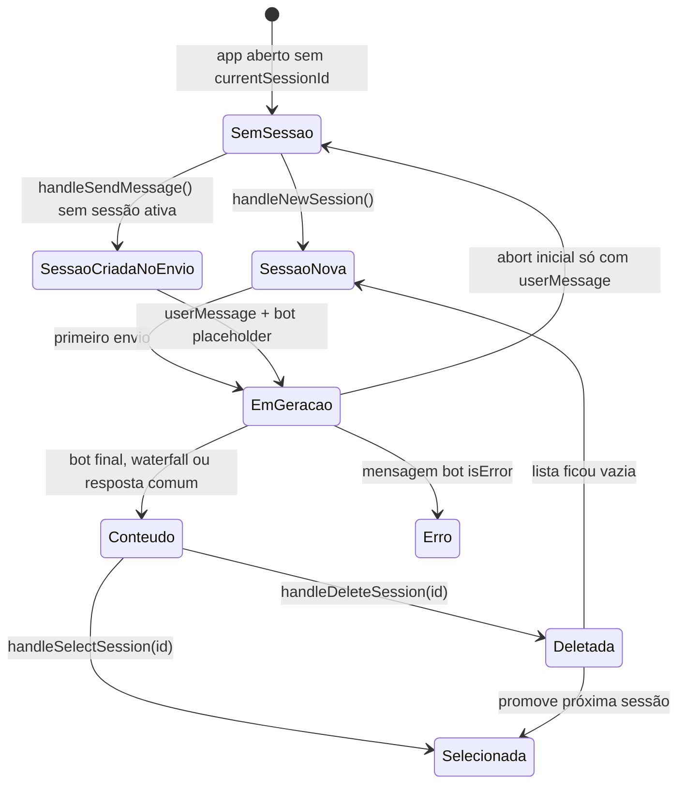

`ChatSession` é o agregado de conversa persistido pelo app: a store em memória fica em `stores/chatStore.tsx`, a carga e gravação automática ficam em `hooks/useSessionStorage.ts`, o ciclo de criar/selecionar/deletar fica em `features/chat/session-controller.ts`, e o conteúdo persistente é salvo como dossiê em `services/storage/dossiers.ts`.

## Superfícies principais

| Superfície                              | Papel                                                                                                                 |
| --------------------------------------- | --------------------------------------------------------------------------------------------------------------------- |
| `types.ts`                              | Define `Sender`, `Message`, `ChatSession` e contratos de props do chat.                                               |
| `stores/chatStore.tsx`                  | Expõe `sessions`, `currentSessionId`, `currentSession`, `allMessages`, refs de geração e estado de loading.           |
| `hooks/useSessionStorage.ts`            | Carrega sessões, sanitiza mensagens, migra IDB para Supabase, persiste com debounce e fallback local.                 |
| `features/chat/session-controller.ts`   | Implementa `handleNewSession`, `handleSelectSession`, `handleDeleteSession` e `handleSaveRemote`.                     |
| `features/chat/message-orchestrator.ts` | Cria sessão no primeiro envio, adiciona mensagens, controla placeholder do bot, retry, erro e finalização de loading. |
| `components/ChatInterface.tsx`          | Converte sessão e mensagens em estado visual do painel.                                                               |
| `components/chat/MessageTimeline.tsx`   | Renderiza home, gate de operador, timeline Virtuoso, viewport suspenso e fallback estático.                           |

<Note>
O modelo de sessão é portável: `ChatSession` e `Message` não carregam chave, SDK ou configuração de provedor. A geração atual passa por fachadas como `sendMessageToGemini`, mas o contrato persistido guarda texto, fontes, status, score, feedback e metadados de dossiê.
</Note>

## Modelo de dados

### `ChatSession`

| Campo               | Tipo              | Uso                                                                          |
| ------------------- | ----------------- | ---------------------------------------------------------------------------- |
| `id`                | `string`          | Identificador da sessão e chave do dossiê persistido.                        |
| `title`             | `string`          | Nome exibido no histórico; pode ser reescrito a partir da empresa detectada. |
| `empresaAlvo`       | `string \| null`  | Empresa principal da investigação.                                           |
| `cnpj`              | `string \| null`  | CNPJ associado ao alvo quando disponível.                                    |
| `modoPrincipal`     | `string \| null`  | Modo atual da investigação, inicializado com `DEFAULT_MODE`.                 |
| `scoreOportunidade` | `number \| null`  | Score comercial consolidado.                                                 |
| `resumoDossie`      | `string \| null`  | Resumo persistido do dossiê.                                                 |
| `createdAt`         | `string`          | Data ISO de criação.                                                         |
| `updatedAt`         | `string`          | Data ISO atualizada em mutações de sessão.                                   |
| `messages`          | `Message[]`       | Histórico de mensagens renderizável.                                         |
| `companyContext`    | `string` opcional | Contexto adicional da empresa.                                               |

### `Message`

| Campo                                     | Tipo                          | Uso                                                                                   |
| ----------------------------------------- | ----------------------------- | ------------------------------------------------------------------------------------- |
| `id`                                      | `string`                      | Identificador da mensagem, usado como chave de renderização.                          |
| `sender`                                  | `Sender.User` ou `Sender.Bot` | Define lado visual e comportamento.                                                   |
| `text`                                    | `string`                      | Conteúdo renderizado e persistido.                                                    |
| `timestamp`                               | `Date`                        | Horário usado na UI; strings carregadas da persistência são convertidas para `Date`.  |
| `isThinking`                              | `boolean` opcional            | Placeholder transitório de geração; é normalizado para `false` ao persistir/carregar. |
| `loadingVariant`                          | `'hero' \| 'inline'` opcional | Estado transitório de UI, removido da persistência.                                   |
| `isError` / `errorDetails`                | opcionais                     | Renderizam `ErrorMessageCard`.                                                        |
| `groundingSources`                        | array opcional                | Fontes consultadas/citadas.                                                           |
| `suggestions`                             | `string[]` opcional           | Sugestões de continuidade.                                                            |
| `scorePorta`                              | `ScorePortaData` opcional     | Score anexado à resposta do bot.                                                      |
| `clienteSeniorData`                       | opcional                      | Dados de lookup Senior.                                                               |
| `groundingUsed` / `webVerificationStatus` | opcionais                     | Status de verificação web.                                                            |
| `feedback` / `sectionFeedback`            | opcionais                     | Feedback por mensagem ou seção.                                                       |

## Ciclo de sessão



### Inicialização

`useAppInitialization` faz warm-up do lookup, chama `loadSessions()`, mescla sessões carregadas com sessões locais criadas durante a carga e só define `currentSessionId` se ainda não existir sessão ativa. Em mobile, a sidebar é fechada no boot.

`useSessionStorage` também executa carga inicial própria. A carga usa esta ordem:

1. Migração uma vez de `scout360_sessions_v2` no IndexedDB para Supabase, controlada por `scout360:migration_v2_complete`.
2. `storage.getDossiers()` quando Supabase e `scout360:operator_id` estão disponíveis.
3. Fallback local em `localStorage['scout360_sessions_v1']`.
4. Array vazio quando nada é recuperável.

### Nova sessão

`handleNewSession()` tem dois comportamentos:

| Condição              | Comportamento                                                                                                                                                             |
| --------------------- | ------------------------------------------------------------------------------------------------------------------------------------------------------------------------- |
| `isLoading === true`  | Aborta `abortControllerRef.current`, limpa loading, zera `currentSessionId` e reseta a UI. Não cria nova sessão.                                                          |
| `isLoading === false` | Cria `ChatSession` com `uuidv4()`, título `Nova Investigação`, `DEFAULT_MODE`, campos de dossiê nulos e `messages: []`; adiciona no início da lista e seleciona a sessão. |

O reset de UI restaura `visibleCount` para `20`, limpa status de salvamento/exportação, `pdfReportContent`, `investigationLogged`, `lastActionRef`, `lastQuery` e reinicia o progresso com `Iniciando análise`.

### Primeiro envio sem sessão ativa

`handleSendMessage()` cria uma sessão automaticamente quando não há `currentSessionId` ou quando a sessão ativa não existe mais em `sessionsRef.current`. O título imediato vem de `hintedCompanyOverride` ou da empresa extraída do texto; se a extração for genérica, usa `Nova Investigação`.

Depois disso, o fluxo adiciona a mensagem do usuário, incrementa `visibleCount`, cria um placeholder bot com `isThinking: true` e `loadingVariant`, e chama `processMessage()`.

<Warning>
Se uma sessão inicial criada pelo envio for abortada e ficar apenas com a mensagem do usuário, o orchestrator descarta essa sessão e volta `currentSessionId` para `null`.
</Warning>

### Seleção

`handleSelectSession(sessionId)` aborta geração em andamento antes de trocar de sessão, limpa loading/pinned label, define `currentSessionId`, reseta a UI e registra `dossier_opened` quando há operador. Se a sessão selecionada existe, mas está sem mensagens, faz lazy load por `getRemoteSession(sessionId)` e substitui a sessão quando o payload completo chega.

A sidebar (`SessionsSidebar`) filtra por empresa, CNPJ, título ou nome exibido, ordena por `updatedAt` descendente e mostra preview com a última mensagem do bot quando houver.

### Deleção

`handleDeleteSession(sessionId)` executa soft delete remoto por `storage.deleteDossier(sessionId)` em modo fire-and-forget, remove a geração ativa daquele ID e filtra a sessão da lista local.

Se a sessão deletada era a atual:

| Resultado         | Comportamento                                                                               |
| ----------------- | ------------------------------------------------------------------------------------------- |
| Ainda há sessões  | Promove a primeira sessão restante, reseta a UI e faz lazy load se ela não tiver mensagens. |
| Lista ficou vazia | Chama `handleNewSession()`.                                                                 |
| Estava carregando | Aborta o controller ativo e seta `isLoading(false)`.                                        |

## Persistência

### Supabase `dossies`

`services/storage/dossiers.ts` usa a tabela `dossies` quando `VITE_SUPABASE_URL`, `VITE_SUPABASE_ANON_KEY` e `scout360:operator_id` estão disponíveis.

| Operação                    | Contrato                                                                                                            |
| --------------------------- | ------------------------------------------------------------------------------------------------------------------- |
| `getDossiers()`             | Seleciona `content` por `operator_id`, ignora `deleted_at`, ordena por `updated_at desc` e retorna `ChatSession[]`. |
| `getDossier(id)`            | Busca um dossiê por `id` e `operator_id`, ignorando `deleted_at`.                                                   |
| `saveDossier(session)`      | Faz upsert de uma sessão individual.                                                                                |
| `saveAllDossiers(sessions)` | Faz upsert em lote das sessões atuais.                                                                              |
| `deleteDossier(id)`         | Marca `deleted_at` e atualiza `updated_at`; não remove fisicamente.                                                 |

O payload de upsert grava colunas indexáveis (`title`, `empresa_alvo`, `cnpj`, `modo_principal`, `score_oportunidade`, `resumo_dossie`, `operator_email`) e o agregado completo em `content`.

### Estado transitório

Antes de persistir ou devolver sessões carregadas, o storage remove estado transitório de mensagem:

| Campo                         | Normalização                            |
| ----------------------------- | --------------------------------------- |
| `isThinking`                  | Forçado para `false`.                   |
| `loadingVariant`              | Removido.                               |
| `isSourcesOpen`               | Removido.                               |
| marcadores internos em `text` | Removidos por `stripInternalMarkers()`. |
| `timestamp` carregado         | Convertido para `Date`.                 |

### Fallback local

`useSessionStorage` persiste automaticamente com debounce de `1000ms` após mudanças em `sessions`, desde que `isInitialized` esteja verdadeiro. A escrita principal chama `storage.saveAllDossiers(data)`. Se essa escrita falhar, grava o array em `localStorage['scout360_sessions_v1']`.

Quando o `localStorage` estoura quota (`QuotaExceededError` ou `code === 22`), o fallback corta as sessões mais antigas com `data.slice(0, Math.max(data.length - 5, 1))` e tenta gravar novamente.

<Info>
No unmount, o hook limpa o timer pendente e tenta um flush fire-and-forget de `sessionsRef.current` via `storage.saveAllDossiers()`.
</Info>

### Mudança de operador

O evento `operator-relinked` recarrega sessões. Quando a carga retorna dados, o hook mescla sessões carregadas com as sessões locais que não têm o mesmo ID. Isso preserva sessões criadas no cliente enquanto o novo operador é vinculado.

## Salvamento remoto manual

`useSessionRemoteSave()` é separado da persistência automática de `dossies`. Ele usa `saveRemoteSession(session, operatorId, operatorName)` em `services/sessionRemoteStore.ts`, atualiza `updatedAt` antes de enviar, marca `remoteSaveStatus` como `success` por `3000ms` e volta para `idle`. Falhas registram erro e deixam `remoteSaveStatus: 'error'`.

`sessionRemoteStore` conversa com `BACKEND_URL` usando envelopes de ação:

| Ação           | Método                             | Observação                                        |
| -------------- | ---------------------------------- | ------------------------------------------------- |
| `listSessions` | GET querystring, com fallback POST | Retorna sessões sem mensagens completas.          |
| `getSession`   | POST                               | Retorna sessão completa e parseia `messagesJson`. |
| `saveSession`  | POST                               | Envia `session` com mensagens, score e resumo.    |

Quando o endpoint remoto está indisponível, incompatível ou responde payload de lookup, a listagem retorna `[]` e a sessão completa retorna `null`; o app continua pelo cache local/Supabase.

## Estado renderizado

`classifyPanelState()` limita o painel central a quatro estados válidos:

| Prioridade | Estado    | Condição                                               |
| ---------- | --------- | ------------------------------------------------------ |
| 1          | `error`   | `hasError === true`.                                   |
| 2          | `loading` | `isLoading === true`.                                  |
| 3          | `content` | `messages.length > 0` ou `hasDossierContent === true`. |
| 4          | `empty`   | Nenhuma condição acima.                                |

`ChatInterface` usa essa classificação com `safeMessages`, `hasErrorInMessages`, `isLoading` e `currentSession?.resumoDossie`. Se existe sessão ativa, não é home inicial e o estado é `empty`, renderiza `empty-state` explícito em vez de deixar o centro branco.

## Timeline e fallback estático

`MessageTimeline` renderiza uma destas superfícies:

| Superfície                    | Quando aparece                                                           |
| ----------------------------- | ------------------------------------------------------------------------ |
| `GreetingWelcomeScreen`       | `showOperatorGate`.                                                      |
| `EmptyStateHome`              | `showInitialHome`.                                                       |
| Virtuoso                      | Fluxo normal com viewport pronta.                                        |
| `messages-viewport-suspended` | Timeline suspensa durante hero loading sem conteúdo renderizável.        |
| `messages-static-fallback`    | Recovery final para dossiê `>= 60_000` quando Virtuoso não materializa.  |

Dossiês abaixo de `60_000` caracteres devem permanecer no Virtuoso; blank panel reativo remonta a viewport com `timelineRecoveryNonce`. O fallback estático também tem safety net: se `messages-static-fallback` montar com `display: none`, o componente limpa `style.display` e, se necessário, força `display: block !important`, registrando `static-fallback-display-recovery`.

## Contrato anti-painel branco

O painel principal é `chat-main-panel`. O estado visual válido precisa apresentar pelo menos um destes sinais:

| Sinal                                      | Interpretação                                                       |
| ------------------------------------------ | ------------------------------------------------------------------- |
| `loading-smart-overlay` ou `loading-smart` | Loading intencional.                                                |
| `controlled-error`                         | Erro controlado.                                                    |
| `empty-state`                              | Sessão ativa sem conteúdo renderizável, mas com fallback explícito. |
| `bot-message-content` visível com texto    | Conteúdo real do bot.                                               |

`dossier-content` vazio não é prova suficiente de renderização. Placeholders ou viewport suspenso depois do fim do loading são tratados como falha quando já se espera conteúdo de bot.

Razões diagnosticadas por `collectBlankPanelSnapshot()` incluem:

| Razão                             | Condição típica                                          |
| --------------------------------- | -------------------------------------------------------- |
| `main-panel-not-visible`          | `chat-main-panel` existe, mas sem dimensão/visibilidade. |
| `stuck-viewport-placeholder`      | Placeholder ficou preso após conteúdo esperado.          |
| `stuck-viewport-suspended`        | Viewport suspenso ficou preso após conteúdo esperado.    |
| `no-message-rows-in-panel`        | Nenhuma linha de mensagem no painel.                     |
| `message-rows-not-visible`        | Linhas existem, mas não são visíveis.                    |
| `no-bot-nodes-in-panel`           | Não há nó de bot renderizado.                            |
| `bot-nodes-have-no-visible-chars` | Nó de bot existe, mas sem texto visível.                 |

## Validação

Use testes focados quando alterar sessão, mensagem, persistência ou renderização do painel:

```bash
npm run test:contracts
npm run test:e2e:blank
npm run test:e2e:loading
npm run test:e2e:errors
```

Para mudança ampla nesse fluxo:

```bash
npm run test:flow
```

`test:contracts` cobre o contrato de `renderState`; `test:e2e:blank` cobre painel branco com sessão ativa; `test:e2e:loading` cobre loading infinito; `test:e2e:errors` cobre erro controlado.

## Related pages

<CardGroup>
  <Card title="Loading e estados visuais" href="/loading-estados-visuais">
    Contrato de overlay, timeline, fallback estático, painel branco e sinais de recuperação.
  </Card>
  <Card title="Configurar Supabase" href="/configurar-supabase">
    Variáveis, degradação quando indisponível e tabelas críticas para persistência.
  </Card>
  <Card title="Contratos de UI" href="/ui-contracts-reference">
    `data-testid` oficiais, estados válidos do painel e matriz anti-regressão.
  </Card>
  <Card title="Depurar painel branco" href="/depurar-painel-branco">
    Procedimento para investigar fallback invisível, `PostCompletion`, `FreezeDiag` e validação visual.
  </Card>
</CardGroup>

## Source files

- `types.ts`
- `stores/chatStore.tsx`
- `hooks/useSessionStorage.ts`
- `features/chat/session-controller.ts`
- `services/storage/dossiers.ts`
- `tests/contracts/renderState.contract.test.tsx`
