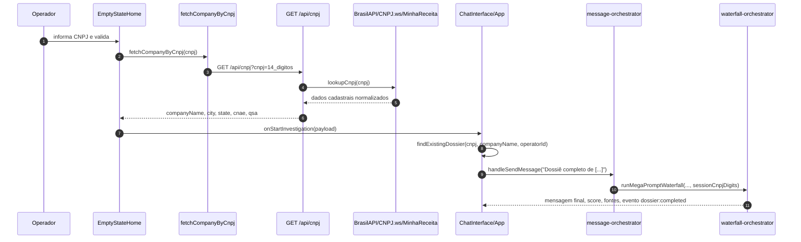

O fluxo CNPJ começa no formulário `EmptyStateHome`, consulta dados cadastrais pelo proxy serverless `GET /api/cnpj`, preenche `companyName`, `city` e `state`, e envia um `StartInvestigationPayload` para `ChatInterface`, que dispara o dossiê completo pelo caminho `App.handleDeepDive` → `useChatMessageOrchestrator` → `useDossierWaterfallOrchestrator`.

## Superfície do fluxo

| Camada | Identificador | Responsabilidade |
| --- | --- | --- |
| Formulário inicial | `components/EmptyStateHome.tsx` | Captura empresa, CNPJ, cidade e UF; executa lookup cadastral; valida cidade/UF antes do submit. |
| Cliente CNPJ | `services/brasilApiService.ts` | Normaliza, valida e chama `/api/cnpj`; trata JSON inválido, timeout e ambiente local sem proxy. |
| API serverless | `api/cnpj.ts` | Aplica CORS e headers de segurança, valida método e CNPJ, chama `lookupCnpj` e retorna JSON normalizado. |
| Lookup oficial | `lib/cnpjLookup.ts` | Consulta BrasilAPI, CNPJ.ws e MinhaReceita no servidor, com cache em memória. |
| Orquestração de chat | `features/chat/message-orchestrator.ts` | Cria sessão, adiciona placeholder do bot, detecta mensagem `DOSSIE COMPLETO` e dispara o waterfall. |
| Waterfall de dossiê | `features/dossier/waterfall-orchestrator.ts` | Usa CNPJ da sessão para contexto QSA/teia, roda módulos do dossiê e finaliza UI/persistência. |
| E2E | `tests-e2e/cnpj-investigation-flow.spec.ts` | Valida lookup, autopreenchimento, submit, resposta renderizada e rejeição de CNPJ inválido. |



## Pré-condições

- O operador precisa passar pelo gate inicial ou já ter contexto local carregado; os testes usam `greeting-*` quando necessário e esperam `investigation-company-input` ficar visível.
- `companyName` e `city` precisam ter pelo menos 2 caracteres para submit.
- `state` precisa ser uma UF válida do conjunto `AC` a `TO`.
- O CNPJ é opcional para iniciar, mas, quando preenchido, o botão `investigation-cnpj-validate-button` só habilita se `normalizeCnpj` resultar em 14 dígitos e `isValidCnpj` aprovar os dígitos verificadores.
- Em desenvolvimento local, o Vite roda na porta `3000` e tem proxy para `/api/cnpj`. Se a chamada retornar HTML em vez de JSON, o cliente mostra erro de proxy local e orienta usar `vercel dev` ou `VITE_CNPJ_PROXY_URL`.

<Note>
Sem CNPJ confirmado, o próprio formulário avisa que a investigação pode ficar incompleta e reduzir a precisão do Score PORTA. O submit ainda é permitido quando empresa, cidade e UF são válidas.
</Note>

## Lookup cadastral

:::endpoint GET /api/cnpj Consulta cadastral por CNPJ
Retorna dados cadastrais normalizados para o frontend sem expor chamadas diretas do browser às fontes externas.

<ParamField body="cnpj" type="string" required>
CNPJ com ou sem máscara. A API normaliza para 14 dígitos e rejeita valores inválidos com `400`.
</ParamField>

<ResponseField name="cnpj" type="string">
CNPJ normalizado retornado pela fonte oficial.
</ResponseField>

<ResponseField name="companyName" type="string">
Razão social ou nome fantasia escolhido pela fonte consultada.
</ResponseField>

<ResponseField name="city" type="string">
Município cadastral.
</ResponseField>

<ResponseField name="state" type="string">
UF em caixa alta.
</ResponseField>

<ResponseField name="cnae" type="string">
Código CNAE principal, quando disponível.
</ResponseField>

<ResponseField name="cnaeDescricao" type="string">
Descrição do CNAE principal, quando disponível.
</ResponseField>

<ResponseField name="qsa" type="array">
Sócios retornados pela fonte, com `name`, `role`, `document`, `source` e `confidence`.
</ResponseField>

<RequestExample>

```bash
curl "http://localhost:3000/api/cnpj?cnpj=04733767000180"
```

</RequestExample>

<ResponseExample>

```json
{
  "cnpj": "04733767000180",
  "companyName": "SCHEFFER & CIA LTDA",
  "city": "Chapecó",
  "state": "SC",
  "cnae": "string",
  "cnaeDescricao": "string",
  "qsa": []
}
```

</ResponseExample>

Erros esperados:

| Status | Condição | Corpo |
| --- | --- | --- |
| `400` | CNPJ inválido | `{ "error": "CNPJ inválido — verifique os dígitos informados." }` |
| `404` | Todas as fontes indicam não encontrado | `{ "error": "CNPJ ... não encontrado na base da Receita Federal." }` |
| `405` | Método diferente de `GET` ou `OPTIONS` | `{ "error": "Method not allowed" }` |
| `503` | Fontes indisponíveis ou falha agregada | `{ "error": "Serviço de consulta de CNPJ temporariamente indisponível...", "detail": "..." }` |

:::

### Fontes e cache

`lookupCnpj` roda somente no servidor. O comentário do módulo é explícito: callers de browser devem usar `fetchCompanyByCnpj`, porque chamadas diretas para BrasilAPI, CNPJ.ws ou MinhaReceita podem falhar por CORS.

| Fonte | Timeout padrão | Campos mínimos exigidos |
| --- | ---: | --- |
| `BrasilAPI` | 8s | `companyName`, `city`, `state` |
| `CNPJ.ws` | 10s | `companyName`, `city`, `state` |
| `MinhaReceita` | 10s | `companyName`, `city`, `state` |

O cache em memória usa TTL de 7 dias, versão interna `2` e limite de 1000 entradas com remoção da entrada mais antiga.

## Preenchimento do alvo

<Steps>
  <Step title="Informar CNPJ">
    Use `investigation-cnpj-input`. O valor digitado é formatado como `00.000.000/0000-00`, mas o estado interno guarda apenas dígitos normalizados.
  </Step>
  <Step title="Validar cadastro">
    Clique em `investigation-cnpj-validate-button` ou saia do campo. Durante a busca, o status muda para `Buscando dados da empresa...` e o botão mostra `Buscando…`.
  </Step>
  <Step title="Conferir autopreenchimento">
    No sucesso, o status visível é `✓ Dados preenchidos automaticamente via Receita Federal.`. O nome da empresa só é preenchido se estiver vazio; cidade e UF são preenchidas quando vazias ou quando vieram de lookup anterior.
  </Step>
  <Step title="Ajustar se necessário">
    Depois do sucesso, o CNPJ fica travado como `Validado`. O botão `Alterar` desbloqueia o CNPJ e limpa somente campos que foram preenchidos automaticamente, preservando valores digitados manualmente.
  </Step>
  <Step title="Enviar investigação">
    O botão `investigation-submit-button` chama `handleSubmit`, valida cidade/UF via IBGE e envia `{ companyName, cnpj, city, state }`.
  </Step>
</Steps>

### Mensagens de erro do formulário

| Condição | Mensagem ou estado esperado | Efeito |
| --- | --- | --- |
| CNPJ com dígitos inválidos | Botão de validar desabilitado | Lookup não inicia. |
| CNPJ não encontrado | `CNPJ não encontrado na Receita Federal. Preencha os campos manualmente.` | CNPJ não fica travado; preenchimento manual continua disponível. |
| Local sem proxy | `Ambiente local sem proxy para consulta de CNPJ. Rode via vercel dev ou configure o proxy.` | O operador pode preencher manualmente ou corrigir o proxy. |
| Serviço indisponível | `Serviço de consulta indisponível no momento. Preencha os campos manualmente.` | O fluxo não bloqueia a investigação manual. |
| Cidade/UF inválida | `Cidade não encontrada para a UF informada. Verifique o cadastro.` | Submit é interrompido. |
| IBGE indisponível | Sem bloqueio rígido | `validateCityInState` retorna válido para não impedir o operador por indisponibilidade externa. |

## Envio da investigação

O payload de submit tem contrato estável:

<ParamField body="companyName" type="string" required>
Nome da empresa enviado pelo formulário ou preenchido pelo lookup.
</ParamField>

<ParamField body="cnpj" type="string | null">
CNPJ normalizado com 14 dígitos quando informado; `null` quando ausente.
</ParamField>

<ParamField body="city" type="string" required>
Cidade validada ou normalizada pelo IBGE.
</ParamField>

<ParamField body="state" type="string" required>
UF validada em caixa alta.
</ParamField>

Antes de disparar a geração, `ChatInterface` toca o contexto do operador e chama `findExistingDossier`. Se Supabase estiver disponível e houver `operatorId`, a busca tenta primeiro `dossies.cnpj` e depois `dossies.empresa_alvo`, sempre com `deleted_at IS NULL`.

Quando encontra duplicidade, aparece `DuplicateDossierModal` com três caminhos:

| Ação | Resultado |
| --- | --- |
| `Acessar Dossiê Existente` | Carrega do storage local; se ausente, busca `content` em Supabase, salva localmente e seleciona a sessão existente. |
| `Nova Pesquisa do Zero` | Executa nova investigação e depois remove o dossiê anterior. |
| `Cancelar` | Fecha o modal e descarta o payload pendente. |

### Construção do prompt

`executeInvestigation` faz um lookup adicional de CNPJ com timeout de 8s para obter `cnaeDescricao` como `segmentHint`. Falha nesse enriquecimento é registrada em `scoutDiag.warn`, mas não bloqueia o dossiê.

O prompt oculto inclui:

- `companyName`, `cnpj`, `city`, `state` e `segmentHint`;
- `PromptVersion`;
- `StrictAudit=ON`;
- `DiscrepancyHunter=ON`;
- `CostOfDelay=ON`;
- `IncludeBudget=ON` quando há CNPJ, War Room, modo ultra ou contexto relevante do Radar.

`App.handleDeepDive` transforma o submit em uma mensagem visível de investigação e passa o CNPJ nas opções:

```text
Dossiê completo de [EMPRESA]. Protocolo de investigação forense especializada:
```

`message-orchestrator` identifica o fluxo principal quando a mensagem normalizada contém `DOSSIE COMPLETO` e `requestKind` não é `deep_dive`.

## Waterfall e estados esperados

O waterfall usa `WaterfallGuard` para evitar restart loop: só um waterfall global pode rodar por vez, uma sessão não pode ter duas execuções simultâneas e há cooldown de 5s após conclusão.

Durante a execução, o CNPJ salvo na sessão entra como `sessionCnpjDigits`. O waterfall tenta montar contexto de teia com QSA oficial:

- chama `fetchCompanyByCnpj(sessionCnpjDigits)`;
- adiciona o CNPJ raiz aos CNPJs conhecidos;
- captura quantidade de sócios, UF e CNAE;
- gera bloco `[QSA OFICIAL]` para o contexto estático do dossiê.

As etapas visuais do dossiê são:

| Ordem | Etapa |
| ---: | --- |
| 1 | `Mapeando conta real e teia societária...` |
| 2 | `Mapeando operação e cadeia de valor...` |
| 3 | `Identificando bordas de controle...` |
| 4 | `Verificando pressões e compliance...` |
| 5 | `Mapeando caminho de venda...` |
| 6 | `Cruzando referências de mercado...` |
| 7 | `Finalizando cards de auditoria...` |
| Final | `Consolidando informações...` |

Na conclusão, o bot deixa `isThinking=false`, recebe `text`, `scorePorta`, `clienteSeniorData`, `groundingSources`, `webVerificationStatus` e `suggestions`. A persistência em `storage.saveDossier` é fire-and-forget; se falhar, a sessão permanece em memória e o evento `dossier:completed` não é disparado.

<Check>
Estado visual final válido: `loading-smart-overlay` ausente, composer habilitado, painel central visível e pelo menos um `bot-message-content` renderizado com texto do dossiê.
</Check>

## Validação E2E

### Fluxo CNPJ real

O gate dedicado é:

```bash
npm run test:e2e:cnpj
```

Sem `BASE_URL`, o Playwright usa `http://localhost:3000` e sobe `npm run dev` pelo `webServer` configurado. Para preview externo:

```bash
BASE_URL=https://seu-preview.vercel.app npx playwright test tests-e2e/cnpj-investigation-flow.spec.ts --config=playwright.config.ts
```

O teste cobre:

| Passo | Assert principal |
| --- | --- |
| Abrir app | Texto `Dados do alvo` visível em até 15s. |
| Preencher Scheffer `04.733.767/0001-80` | Campo `investigation-cnpj-input` aceita máscara. |
| Validar CNPJ | Mensagem `Dados preenchidos automaticamente via Receita Federal` visível em até 30s. |
| Conferir alvo | `investigation-company-input`, `investigation-city-input` e `investigation-uf-input` não ficam vazios. |
| Enviar | `investigation-submit-button` habilitado e clicável. |
| Receber dossiê | Primeiro `.prose` visível em até 120s. |
| Qualidade mínima | Texto renderizado maior que 50 caracteres. |
| CNPJ inválido | `00.000.000/0000-00` mantém o botão de validar desabilitado. |

### Regressão visual pós-waterfall

Para mudanças em loading, timeline, Virtuoso, fallback estático ou dossiê grande, rode também:

```bash
npx playwright test tests-e2e/scheffer-cnpj-blank-panel.spec.ts
```

Esse teste usa stubs rápidos de `/api/gemini`, mas mantém o fluxo CNPJ e valida o contrato visual crítico:

- `loading-smart-overlay` aparece e depois some;
- `chat-main-panel` fica visível;
- `messages-viewport-suspended` e `messages-viewport-placeholder` não permanecem no painel;
- último `bot-message-content` contém o sentinela E2E;
- `data-text-length` passa de `E2E_DOSSIER_MIN_CHARS`;
- a renderização final usa `messages-static-fallback` ou Virtuoso.

## Troubleshooting

| Sintoma | Verificação | Correção esperada |
| --- | --- | --- |
| Botão `Validar CNPJ` desabilitado | `normalizeCnpj(cnpj).length === 14` e `isValidCnpj(cnpj)` | Corrigir dígitos ou usar preenchimento manual sem CNPJ. |
| Lookup retorna HTML no local | Erro `Local dev sem proxy para /api/cnpj` | Rodar pelo Vite na porta `3000`, usar `vercel dev` ou configurar `VITE_CNPJ_PROXY_URL`. |
| CNPJ existe, mas API retorna `503` | Logs `[api/cnpj] request:error` e `[cnpjLookup] todas as fontes falharam` | Repetir depois ou preencher manualmente; não chamar fonte externa direto do browser. |
| Modal de duplicidade aparece | Busca em `dossies` encontrou CNPJ ou `empresa_alvo` para o mesmo operador | Acessar existente ou iniciar nova pesquisa explicitamente. |
| Dossiê termina, mas painel parece vazio | Procurar `WaterfallLifecycle/health-check-final`, `PostCompletion`, `ui-finalize-state` e `ui-finalize-post-render` | Validar com o teste de Scheffer e a página de loading antes de concluir regressão corrigida. |
| Supabase indisponível | `findExistingDossier` retorna `null`; persistência final pode falhar sem bloquear UI | Confirmar dossiê no estado visual antes de depender de sincronização remota. |

## Portabilidade

O fluxo CNPJ não depende de skill pack, conector proprietário ou estado da wiki para funcionar. A página documenta contratos do próprio repo: formulário React, endpoint serverless, funções TypeScript e testes Playwright. A geração de IA passa pela fachada atual do projeto; qualquer troca BYOC/BYOK deve preservar os contratos de submit, sessão, `/api/gemini` e `services/geminiService.ts`, sem acoplar o formulário CNPJ a SDK de fornecedor.

## Related pages

<CardGroup>
  <Card title="Primeira execução" href="/primeira-execucao">
    Fluxo inicial do operador até o formulário de investigação.
  </Card>
  <Card title="Waterfall de dossiê" href="/dossie-waterfall">
    Pipeline modular acionado depois do submit CNPJ.
  </Card>
  <Card title="Loading e estados visuais" href="/loading-estados-visuais">
    Contrato de overlay, timeline, fallback estático e painel branco.
  </Card>
  <Card title="Referência de APIs serverless" href="/api-serverless-reference">
    Contratos das rotas `api/*.ts`, incluindo métodos, erros e runtime.
  </Card>
  <Card title="Testes e gates" href="/testes-gates">
    Comandos npm, E2E críticos e critérios de validação por mudança.
  </Card>
</CardGroup>

## Source files

- `components/ChatInterface.tsx`
- `services/brasilApiService.ts`
- `api/cnpj.ts`
- `features/chat/message-orchestrator.ts`
- `features/dossier/waterfall-orchestrator.ts`
- `tests-e2e/cnpj-investigation-flow.spec.ts`
