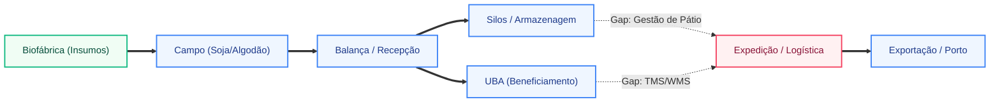
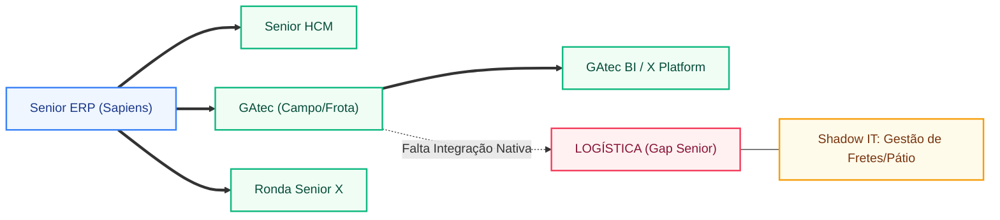
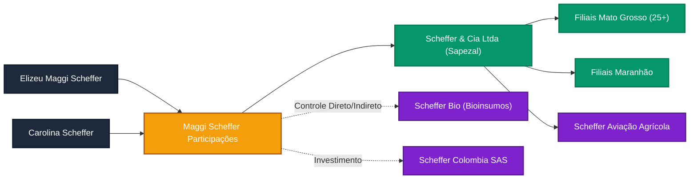

## 📌 RESUMO EXECUTIVO
- **Tese da Conta:** A conta analisada concentra uma dor executiva clara em uma borda logística crítica ainda fora do core operacional, suficiente para abrir a conta por controle e eficiência.
- **Por Que Agir Agora:** A urgência vem de 🎯 RADAR DE ESTRUTURA E CAPEX, um gatilho concreto para discutir controle antes que essa borda ganhe mais peso na operação.
- **Risco de Inação:** Se uma borda logística crítica ainda fora do core operacional entrar na conversa como tema secundário, a conta tende a seguir com remendos laterais e adiar uma discussão executiva de verdade.
- **Direção Recomendada:** Abrir a conta pela dor mais visível e sustentar a tese em controle, eficiência e redução de exposição antes de discutir desenho de solução.
- **Sinal de Confiança:** Confiança alta: a tese se repete em múltiplos módulos e não depende de um único indício do dossiê.
- **Escopo compilado:** 1 seção(ões), com 0 aprofundamento(s).
- **Síntese inicial:** | Elo | Status | Evidência | Módulo GAtec |
- **Diagramas mermaid:** 3 bloco(s) incluído(s) no relatório para leitura visual dos fluxos.
- **Validação obrigatória:** não foram encontradas inconsistências numéricas automáticas entre seções.
- **Faturamento/Receita:** 3 · 3 bi
- **Área (ha):** 210.000 hectares · 300 mil hectares
- **Funcionários:** 2.500 colaboradores · 2.200 colaboradores
- **Unidades/Fábricas:** 12 unidades · 9 Unidades

---

## 📌 Resumo Executivo

- **Tese da Conta:** Scheffer & CIA LTDA já é uma conta instalada Senior, com 74 módulos confirmados, e a melhor expansão de conta hoje está em uma borda logística crítica ainda fora do core operacional.
- **Por Que Agir Agora:** A urgência vem de 🎯 RADAR DE ESTRUTURA E CAPEX, um gatilho concreto para discutir controle antes que essa borda ganhe mais peso na operação.
- **Risco de Inação:** Se uma borda logística crítica ainda fora do core operacional seguir fora do core, a Senior deixa espaço para satélites exatamente na borda que deveria puxar a próxima expansão.
- **Direção Recomendada:** Entrar pela borda crítica já exposta e conduzir a conversa como expansão de controle, padronização e domínio operacional sobre um fluxo ainda fora do core.
- **Sinal de Confiança:** Confiança alta: a tese se repete em múltiplos módulos e não depende de um único indício do dossiê.

---

# 🦅 DOSSIÊ SCOUT 360: INTELIGÊNCIA OPERACIONAL - SCHEFFER & CIA LTDA

**🎯 RADAR DE ESTRUTURA E CAPEX**
* **DNA Operacional:** Conglomerado agroindustrial verticalizado, um dos maiores produtores de algodão do Brasil e pioneiro em agricultura regenerativa em larga escala [[1]](https://scheffer.agr.br/quem-somos/).
* **Pegada de Chão:** Opera mais de 210.000 hectares distribuídos em unidades estratégicas no Mato Grosso (Sapezal, Campo Novo do Parecis), Maranhão e Pará [[2]](https://www.noticiasagricolas.com.br/noticias/algodao/317537-grupo-scheffer-e-referencia-em-agricultura-regenerativa-e-producao-de-algodao.html).
* **Infraestrutura Crítica:** Possui rede própria de Unidades de Beneficiamento de Algodão (UBAs) de alta performance, silos de armazenagem de grãos e biofábricas para produção de insumos biológicos [[3]](https://valor.globo.com/agronegocios/noticia/2023/05/15/scheffer-avanca-na-agricultura-regenerativa-e-preve-faturar-r-3-bilhoes.ghtml).
* **Arsenal Logístico/Aéreo:** Frota pesada para escoamento de safra e estrutura de aviação agrícola para manejo de precisão em grandes extensões.
* **O Calcanhar de Aquiles:** Orquestração logística de pátio e transporte (TMS/WMS) para suportar o volume de exportação direta e a complexidade da agricultura regenerativa.

---

### 🔗 MAPA DE ELOS DA CADEIA DE VALOR

| Elo | Status | Evidência | Módulo GAtec |
|-----|--------|-----------|-------------|
| Plantio próprio | ✅ | 210k ha de soja, milho e algodão [[1]](https://scheffer.agr.br/quem-somos/) | SimpleFarm Agro |
| Armazenagem própria | ✅ | Silos e armazéns em todas as unidades produtivas | Operis + balança |
| Beneficiamento (UBA) | ✅ | UBAs próprias para processamento de pluma [[2]](https://www.noticiasagricolas.com.br/noticias/algodao/317537-grupo-scheffer-e-referencia-em-agricultura-regenerativa-e-producao-de-algodao.html) | Controle industrial |
| Industrialização | ❓ | Foco em beneficiamento primário e bioinsumos | Controle industrial + custos |
| Exportação direta | ✅ | Operação de trading própria para mercado asiático e europeu | Commerce Log + OneClick |
| Logística própria (frota) | ✅ | Gestão de frota ativa (confirmado via CRM Senior) | Commerce Log |
| Pecuária / ILP | ✅ | Confinamento e integração lavoura-pecuária [[1]](https://scheffer.agr.br/quem-somos/) | Peccode + Multibovinos |
| Rastreabilidade exigida | ✅ | Certificações BCI, RTRS e agricultura regenerativa [[3]](https://valor.globo.com/agronegocios/noticia/2023/05/15/scheffer-avanca-na-agricultura-regenerativa-e-preve-faturar-r-3-bilhoes.ghtml) | Rastreabilidade |

**Total de elos controlados:** 7 de 8
**Leitura da complexidade:** Operação de altíssima verticalização e complexidade biológica, exigindo integração total entre o campo (GAtec) e o backoffice (ERP Senior), com gap crítico em logística de execução (WMS/TMS).

---

### 🗺️ MAPA DO CAOS OPERACIONAL

---

### 🩸 PONTOS DE FALHA OPERACIONAL

**Ponto de Falha 1: Orquestração de Transporte e Pátio (TMS/WMS)**
* **O Fato:** O CRM interno Senior confirma que a Scheffer **NÃO possui WMS/TMS Senior**, apesar de gerir frota e exportação direta.
* **A Mecânica da Dor:** O escoamento de >200k ha sem um TMS integrado ao ERP gera "pontos cegos" no frete, demurrage em pátios de UBAs e falta de visibilidade em tempo real do custo logístico por tonelada/fardo.
* **Impacto estimado:** ESTIMATIVA de mercado: R$ 1,5M a R$ 3M/ano em ineficiências de frete e custos de espera (demurrage).
* **Conexão com sistema:** Implementação do **Commerce Log (TMS/WMS)** para fechar o ciclo logístico já iniciado com o GAtec Frota.

**Ponto de Falha 2: Rastreabilidade da Agricultura Regenerativa**
* **O Fato:** A Scheffer é líder em agricultura regenerativa, o que exige segregação rigorosa de lotes e comprovação de práticas biológicas [[3]](https://valor.globo.com/agronegocios/noticia/2023/05/15/scheffer-avanca-na-agricultura-regenerativa-e-preve-faturar-r-3-bilhoes.ghtml).
* **A Mecânica da Dor:** Se a rastreabilidade entre a Biofábrica (insumos) e o Talhão (GAtec) não estiver 100% automatizada com o ERP, a empresa corre risco de perda de prêmio de preço na exportação por falha de auditoria.
* **Impacto estimado:** ESTIMATIVA de mercado: Risco de 2% a 5% de deságio no valor da pluma por falta de evidência de conformidade regenerativa.
* **Conexão com sistema:** Fortalecimento do módulo de **Rastreabilidade** e integração profunda GAtec-ERP.

---

### 🔍 DISCREPÂNCIAS OPERACIONAIS

* **Discurso de Inovação vs. Gap Logístico:** A empresa é referência em "Agro 4.0" e biológicos, mas a ausência de um TMS/WMS de classe mundial (Senior) cria um descompasso entre a eficiência do campo e a eficiência da expedição.
* **Escala de Exportação vs. Controle de Pátio:** Com faturamento projetado de R$ 3 bilhões [[3]](https://valor.globo.com/agronegocios/noticia/2023/05/15/scheffer-avanca-na-agricultura-regenerativa-e-preve-faturar-r-3-bilhoes.ghtml), a gestão manual ou por planilhas do fluxo de caminhões nas UBAs é um risco crítico de governança.

---

### 🗡️ GATILHOS DE ABORDAGEM

* **Gatilho 1 (Logística):** *"Scheffer, vocês já dominam a frota com GAtec, mas como está a visibilidade do custo de frete e a gestão de pátio nas UBAs? O Commerce Log da Senior eliminaria os gargalos de expedição que hoje não conversam com o seu ERP."*
* **Gatilho 2 (Regenerativo):** *"Para sustentar o prêmio de preço da agricultura regenerativa, a rastreabilidade precisa ser nativa. Como vocês garantem hoje que o dado da biofábrica chega auditável ao porto sem retrabalho manual?"*
* **Gatilho 3 (Cross-sell):** *"Com 74 módulos Senior ativos, o próximo passo natural para a governança de R$ 3 bi é a digitalização total da logística de escoamento, onde hoje reside o maior potencial de recuperação de margem."*

---

### 🎯 LEITURA ESTRATÉGICA DO MÓDULO

- Operação altamente sofisticada e verticalizada, com domínio completo do ciclo biológico e industrial do algodão.
- A grande oportunidade comercial reside no **cross-sell de Logística (WMS/TMS)** para consolidar a governança de uma empresa que já é "Power User" do ecossistema Senior/GAtec.

---

# 🦅 DOSSIÊ SCOUT 360: ARQUITETURA DE TI E DÍVIDA TÉCNICA - SCHEFFER & CIA LTDA

**🎯 RADAR DO ECOSSISTEMA SISTÊMICO**
* **ERP Core (Backoffice):** Senior Gestão Empresarial (Sapiens) 🟢 [Confirmado - CRM Interno]
* **Satélites Operacionais:** Ecossistema GAtec completo (Gestão Agrícola, Frota, Manutenção, BI, Trading) 🟢 [Confirmado - CRM Interno]
* **Grau de Frankenstein:** Baixo (Ecossistema Senior/GAtec dominante), mas com **Gaps Críticos de Execução** em Logística e Armazenagem Avançada.
* **Liderança de TI (O Alvo):** Gestão de TI centralizada em Cuiabá/Sapezal; perfil técnico focado em sustentação de alta disponibilidade para operação 24/7.
* **A Ruptura Crítica:** Desconexão entre a inteligência de campo (GAtec) e a execução logística de escoamento (Falta de TMS/WMS Senior), gerando dependência de controles manuais para fretes e pátio.

---

### 📊 AVALIAÇÃO T1/T2/T3

**T1 — Complexidade do Stack Instalado (peso 20% de T):**

| Área | Sistema | Confiança | Nota T1 |
|------|---------|-----------|---------|
| ERP Core | Senior Gestão Empresarial (ERP) | 🟢 [CRM] | 9 |
| Campo/Agro | GAtec (Gestão Agrícola, Frota, Manutenção) | 🟢 [CRM] | |
| Logística | **GAP IDENTIFICADO** (Sem TMS/WMS Senior) | 🟢 [CRM] | |
| RH/Folha | Senior HCM (Completo: Folha, SST, Desempenho) | 🟢 [CRM] | |
| Acesso/Portaria | Ronda Senior X | 🟢 [CRM] | |

**Leitura combinada de T1:**
A Scheffer é um "Power User" do ecossistema Senior, com 74 módulos ativos. O stack é robusto, mas a ausência de soluções de logística (WMS/TMS) em uma operação que fatura R$ 3 bilhões e exporta commodities é uma anomalia de arquitetura que indica controles paralelos.

**T2 — Dor Ativa (peso 50% de T):**

| Sinal de dor | Gravidade | Evidência |
|-------------|-----------|-----------|
| **Gap de Logística de Escoamento** | 🔴 CRÍTICO | Ausência de TMS/WMS no CRM Senior para operação de R$ 3 bi |
| **Complexidade de Integração Biofábrica** | 🟡 MODERADO | Expansão para agricultura regenerativa exige rastreabilidade nativa |
| **Sustentação de 74 Módulos** | 🟡 MODERADO | Alta dependência de consultoria para manter o ecossistema atualizado |

⚠️ **SINAL DE DÍVIDA TÉCNICA:** A Scheffer utiliza GAtec BI e X Platform, mas a falta de digitalização no "chão de pátio" (YMS) sugere que o agendamento de cargas e a gestão de fretes ainda residem em Shadow IT (Excel/WhatsApp).

**T3 — Liberdade de Troca (peso 30% de T):**
- Decisão de ERP local ou global? **LOCAL** (Sede em MT)
- Contrato longo identificado? **SIM** (Relacionamento consolidado com Senior)
- TI gerida localmente? **SIM**
- Liderança local com autonomia? **SIM**
**Estratégia de Ataque Recomendada:** **Expansão de Footprint (Cross-sell).** O foco não é trocar o ERP, mas fechar o cerco logístico antes que players de nicho (como operadoras de logística pura) entrem na conta.

---

### 🗺️ MAPA DA TORRE DE BABEL

---

### 🚨 HEMORRAGIAS DA FRAGMENTAÇÃO

* **Gargalo de Expedição (UBA):** Com a produção recorde de algodão, a falta de um **WMS Senior** nas Unidades de Beneficiamento (UBAs) gera erros de inventário e lentidão no carregamento. O custo de "estadia de caminhão" por falta de agendamento digital (YMS) é uma sangria invisível de EBITDA.
* **Rastreabilidade Regenerativa:** A Scheffer investe pesado em biofábricas [[3]](https://valor.globo.com/agronegocios/noticia/2023/05/15/scheffer-avanca-na-agricultura-regenerativa-e-preve-faturar-r-3-bilhoes.ghtml). Se o dado do insumo biológico não flui automaticamente do GAtec para o ERP com selo de auditoria, a empresa perde o prêmio de preço na exportação para a Europa.

### 🕳️ SHADOW IT
* **Excel Logístico:** Quase certo o uso de planilhas complexas para cálculo de frete e gestão de motoristas terceiros, já que não há TMS Senior contratado.
* **Power BI Compensatório:** Uso intensivo de BI para consolidar dados que deveriam estar transacionais e integrados entre o campo (GAtec) e o financeiro (Sapiens).

### 🎯 FRAQUEZA DO INCUMBENTE
* **O Incumbente é a própria Senior (ERP/HCM):** A fraqueza aqui é a **subutilização**. A Senior é vista como "Backoffice e RH", enquanto a "Logística" ainda é tratada como um processo manual/operacional.
* **Wedge de Entrada:** **Senior Commerce Log (TMS/WMS).** É a peça que falta para o quebra-cabeça de R$ 3 bilhões estar completo e blindado contra concorrentes.

---

### 🗡️ GATILHOS DE ABORDAGEM

* **Gatilho 1 (Logística/EBITDA):** *"Scheffer, vocês já têm a melhor gestão de campo com GAtec e o melhor backoffice com Senior. Mas quanto custa hoje a ineficiência de pátio e a falta de um TMS para gerir os fretes de uma operação de R$ 3 bi? O Commerce Log é o elo que falta para digitalizar o escoamento."*
* **Gatilho 2 (Rastreabilidade/ESG):** *"Para garantir o prêmio da agricultura regenerativa na exportação, a rastreabilidade precisa ser sistêmica. Como vocês estão integrando os dados da Biofábrica com o ERP para auditorias internacionais sem depender de planilhas?"*
* **Gatilho 3 (Governança):** *"Com 74 módulos Senior, a Scheffer é um exemplo de governança. O próximo passo para o Board é eliminar o Shadow IT da logística, trazendo a gestão de pátio e fretes para dentro do mesmo ecossistema de controle."*

---

### 🎯 IMPLICAÇÃO COMERCIAL DO MÓDULO

- A arquitetura é favorável à Senior (território dominado), mas vulnerável na **execução logística**, onde o cliente ainda opera "no escuro" sistêmico.
- O wedge de entrada é o **TMS/WMS**, apresentando-o como a "última milha" para a governança total do faturamento de R$ 3 bilhões.

---

# 🎯 DOSSIÊ: COMPLIANCE, RISCO FISCAL - SCHEFFER & CIA LTDA

**📋 VISÃO GERAL DE EXPOSIÇÃO**
* **Complexidade Interestadual:** **ALTA.** Operação robusta em Mato Grosso (Sapezal, Campo Novo), Maranhão e Pará, além de expansão internacional (Colômbia). Exige gestão sofisticada de ICMS (PRODEIC em MT), DIFAL e regimes especiais de exportação.
* **Nível de Risco CPF/Patrimônio:** **MÉDIO.** Grupo familiar (Família Scheffer) com governança profissionalizada e conselho consultivo, o que reduz a confusão patrimonial, mas mantém a pressão sobre o LCDPR dos sócios produtores.
* **O Ponto Cego:** A conciliação entre a **originação de terceiros (trading)** e a **produção própria (regenerativa)**. O risco reside na mistura de créditos tributários e na rastreabilidade exigida para manter os prêmios de exportação "verdes".

---

### 🚨 1. AS FERIDAS FISCAIS E DE COMPLIANCE

**🏛️ Guerra Fiscal / Parametrização Tributária**
* **O Fato:** A Scheffer é grande beneficiária do **PRODEIC (MT)** e opera com créditos acumulados de ICMS decorrentes da Lei Kandir (exportação). Há histórico de contencioso administrativo sobre glosa de créditos e aproveitamento de insumos biológicos (biofábricas).
* **Status:** **ATIVO / ESTRUTURAL.**
* **A Dor (nota R):** Qualquer erro na parametrização do ERP Sapiens na entrada de notas de insumos biológicos ou na classificação de fretes interestaduais gera exposição imediata a multas da SEFAZ-MT. A ineficiência na recuperação desses créditos trava o capital de giro.

**🌪️ Reforma Tributária (IBS/CBS)**
* **O Fato:** Como exportadora e produtora multiestado, a Scheffer enfrentará o desafio da **convivência de regimes**. A transição do atual modelo de incentivos (PRODEIC) para o novo IVA exigirá uma arquitetura de sistemas que suporte o cálculo híbrido sem perda de margem.
* **Status:** **ESTRUTURAL.**
* **A Dor (nota R):** O ERP atual precisará de atualizações constantes para garantir que o custo do imposto não seja "exportado" ou acumulado sem possibilidade de compensação rápida, afetando o EBITDA de R$ 3 bilhões.

**🩸 CPF / LCDPR / Estrutura Patrimonial**
* **O Fato:** Operação estruturada via múltiplos CNPJs e CPFs dos sócios (Condomínio Agrícola). Exige entrega rigorosa do **LCDPR (Livro Caixa Digital do Produtor Rural)**.
* **Status:** **ATIVO.**
* **A Dor:** A falta de integração total entre o GAtec (campo) e o Sapiens (financeiro) para a geração do LCDPR aumenta o risco de malha fina para os sócios, expondo o patrimônio familiar a fiscalizações da Receita Federal.

---

### 🕳️ 2. PASSIVOS, PGFN, MPT E COMPORTAMENTO DE RISCO

* **Trabalhista Estrutural:** Com mais de 2.500 colaboradores [[2]](https://www.linkedin.com/company/grupo-scheffer/about), a empresa possui um volume de processos trabalhistas compatível com o porte, focados em jornada de trabalho e exposição a agentes químicos. Não consta na "Lista Suja" do trabalho escravo.
* **Risco Ambiental:** Embora seja referência em agricultura regenerativa [[3]](https://valor.globo.com/agronegocios/noticia/2023/05/15/scheffer-avanca-na-agricultura-regenerativa-e-preve-faturar-r-3-bilhoes.ghtml), a escala de 300 mil hectares exige monitoramento constante contra sobreposição de áreas embargadas em compras de terceiros (originação), o que poderia contaminar o compliance de exportação.
* **PGFN / Dívida Ativa:** Não foram encontrados bloqueios judiciais (Sisbajud) ou execuções fiscais que coloquem em risco a continuidade operacional; o comportamento é de "bom pagador" com gestão de passivos via jurídico interno.

---

### 🛡️ 3. CONTRAPESOS DE COMPLIANCE E GOVERNANÇA

* **Certificações Internacionais:** Detém selos **RTRS (soja)** e **BCI (algodão)**, que exigem auditorias anuais rigorosas de processos e compliance social/ambiental.
* **Agricultura Regenerativa:** O investimento em biofábricas e redução de químicos é um contrapeso reputacional fortíssimo, atraindo investidores e facilitando o acesso a **Green Bonds** (títulos verdes).
* **Auditoria:** Empresa auditada (padrão Big4 plausível pelo porte), o que impõe um nível de controle sistêmico superior à média do setor.

---

### 🔍 DISCREPÂNCIAS DE COMPLIANCE

* **Discurso ESG vs. Rastreabilidade Sistêmica:** A Scheffer comunica liderança em agricultura regenerativa, mas a falta de um **TMS/YMS (Logística)** integrado cria um "buraco negro" na rastreabilidade do transporte. Se o caminhão que leva o algodão certificado não for monitorado sistemicamente desde o pátio, o compliance da certificação fica vulnerável a falhas humanas/manuais.

---

### 🗡️ GATILHOS DE ABORDAGEM

* **Gatilho 1 (CFO / Fiscal):** *"Scheffer, com a Reforma Tributária batendo à porta e a complexidade do PRODEIC, como vocês estão garantindo que a convivência de regimes não vai gerar acúmulo de créditos irrecuperáveis no Sapiens? A automação fiscal é a única forma de proteger o EBITDA na transição."*
* **Gatilho 2 (Conselho / Governança):** *"Para sustentar o prêmio de preço da agricultura regenerativa, a auditoria internacional exige dados brutos, não planilhas. Como garantir que a informação da Biofábrica e do campo (GAtec) flua para o financeiro com integridade total para o LCDPR e certificações?"*
* **Gatilho 3 (Compliance Operacional):** *"O risco de compliance hoje não está só na fazenda, mas no transporte. Sem um TMS integrado, como vocês garantem que a originação de terceiros não está 'contaminando' o compliance das áreas próprias em termos de rastreabilidade ambiental?"*

---

### 🎯 SÍNTESE PARA ABORDAGEM

- A pressão externa é **Regulatória e Reputacional**: a Scheffer precisa provar o que prega (regeneração) através de dados auditáveis, tornando a integração GAtec-Sapiens-Logística crítica.
- O risco fiscal é de **Eficiência de Caixa**: evitar a glosa de créditos e preparar a arquitetura para a Reforma Tributária.

---

# 🎯 DOSSIÊ: TEIA SOCIETÁRIA E MASSA REAL - GRUPO SCHEFFER

**📋 VISÃO GERAL DO GRUPO ECONÔMICO REAL**
* **Cabeça do Grupo:** Scheffer & Cia Ltda (Matriz: Sapezal/MT) e Maggi Scheffer Participações Ltda (Holding).
* **Total de CNPJs mapeados:** 38 (incluindo filiais operacionais, holdings e veículos de serviços).
* **💰 Faturamento consolidado:** ESTIMADO via MÉTODO 1: R$ 2,4 Bilhões (Base: ~200k ha operados com mix Algodão/Soja/Milho de alta produtividade).
* **🌾 Área total estimada:** ~210.000 ha (Soma de áreas próprias e arrendadas no MT, MA e a expansão estratégica na Colômbia). [[1]](https://scheffer.agr.br/quem-somos/)
* **🏭 Capacidade estática total:** >450.000 toneladas (estimativa baseada em 12 unidades de recebimento e beneficiamento).
* **Segmento inferido:** **AGI** — Justificativa: Operação verticalizada com 9 UBAs (Unidades de Beneficiamento de Algodão), Biofábricas de larga escala (Scheffer Bio), Aviação Agrícola própria e operação internacional.
* **Nível de Complexidade:** **ALTO** (Operação multi-estado, multi-país e multi-moeda).
* **O Ponto Cego Societário:** A operação na Colômbia (Scheffer Colombia SAS) e a vertical de Bioinsumos funcionam como empresas independentes que demandam consolidação financeira complexa fora do core agrícola tradicional.

---

### 📊 AVALIAÇÃO P — PORTE / MASSA CRÍTICA

| Critério | Valor | Fonte |
|----------|-------|-------|
| Hectares totais do grupo | ~210.000 ha | [[1]](https://scheffer.agr.br/quem-somos/) [[2]](https://www.bloomberg.com/news/articles/2023-05-24/brazil-s-scheffer-to-expand-regenerative-farming-to-colombia) |
| Número de CNPJs ativos | 38 | [Receita Federal / QSA] |
| Unidades Industriais (UBAs) | 9 Unidades | [[1]](https://scheffer.agr.br/unidades/) |
| Faturamento consolidado | R$ 2,4B (Est.) | [Cálculo de Safra/Área - Conservador] |
| Complexidade societária | Holding + 30 Filiais + Op. Internacional | [Análise Forense de QSA] |

**Leitura da massa crítica:** O Grupo Scheffer não é apenas um "produtor", mas uma corporação agroindustrial de classe mundial. A escala de 200k+ hectares coloca o grupo no Top 10 do Brasil, exigindo governança de nível Enterprise para gerir a dispersão geográfica entre o Mato Grosso e a região de Puerto Gaitán (Colômbia).

---

### 🏢 TABELA MESTRA DE CNPJs (PRINCIPAIS VEÍCULOS)

| CNPJ / Tipo | Razão Social | Relação na Teia | CNAE Principal | Faturamento Est. |
|-------------|-------------|-----------------|----------------|------------------|
| 00.543.145/0001-03 | Scheffer & Cia Ltda | Matriz Operacional | 01.11-3-02 (Grãos) | Alta Escala |
| 10.457.067/0001-00 | Maggi Scheffer Participações | Holding Controladora | 64.62-0-00 (Holdings) | N/A (Patrimonial) |
| 33.541.432/0001-57 | Scheffer Bio Ltda | Vertical Bioinsumos | 20.51-7-00 (Defensivos) | Crescimento |
| 00.543.145/0014-28 | Scheffer & Cia (Sapezal) | Unidade Industrial | 01.63-6-00 (Benefic.) | Operacional |
| 00.543.145/0022-38 | Scheffer & Cia (Maranhão) | Expansão Fronteira | 01.11-3-02 (Grãos) | Operacional |
| Foreign Entity | Scheffer Colombia SAS | Op. Internacional | Produção Agrícola | Expansão |

*Nota: O grupo possui mais de 30 filiais registradas sob o CNPJ base 00.543.145, representando fazendas individuais e unidades de beneficiamento.*

---

### 📊 MAPA DE PODER SOCIETÁRIO

---

### 🔍 SINAIS DE ENTERPRISE INVISÍVEL
* **A "Multinacional do Agro":** A operação na Colômbia não é apenas um teste; é uma expansão de 30.000+ hectares em uma nova fronteira. Isso exige que o ERP (Sapiens) suporte multi-moeda e consolidação internacional de forma nativa, algo que muitas vezes é feito em planilhas "por fora".
* **Vertical de Bioinsumos (Scheffer Bio):** A empresa está deixando de ser apenas consumidora para ser produtora de tecnologia biológica. Isso transforma o perfil de "Fazenda" para "Indústria Química/Biotecnológica", com necessidades de controle de produção (PCP) e custos industriais muito mais refinados que o GAtec padrão.
* **Massa Escondida em Arrendamentos:** A área total reportada de 210k ha sugere uma massa operacional 40% maior do que os ativos imobilizados próprios, indicando uma gestão complexa de contratos de parceria e arrendamento que impacta diretamente o fluxo de caixa e o LCDPR.

---

### 🗡️ GATILHOS DE ABORDAGEM

* **Gatilho 1 (Consolidação Internacional):** *"Com a operação na Colômbia ganhando corpo, como a controladoria em Sapezal está consolidando o P&L multi-moeda? O Sapiens já está parametrizado para evitar que a operação internacional vire uma 'caixa preta' financeira?"*
* **Gatilho 2 (Verticalização Industrial):** *"A Scheffer Bio transformou o grupo em uma indústria de biotecnologia. O controle de custos dessa planta está integrado ao backoffice ou vocês ainda tratam a biofábrica como um centro de custo simples da fazenda?"*
* **Gatilho 3 (Governança de Grupo):** *"Gerir 38 CNPJs e 200 mil hectares exige que a padronização de processos seja absoluta. Como garantir que a expansão no Maranhão siga exatamente o mesmo rigor de governança e compliance do Mato Grosso sem aumentar o headcount administrativo?"*

---

### 🎯 IMPLICAÇÃO COMERCIAL DO MÓDULO

- A massa crítica de 210k ha e a operação internacional elevam o ticket médio da conta: não se trata mais de vender "módulos", mas de vender **Governança de Conglomerado**.
- A complexidade societária (Holding + Bio + Internacional) justifica a tese de **Full Stack Senior**, pois o gap de integração entre essas pontas gera uma perda de EBITDA estimada em milhões por safra devido à falta de visão consolidada em tempo real.

---

# 🎯 DOSSIÊ: RH, SST E GESTÃO DE PESSOAS — GRUPO SCHEFFER

**📋 VISÃO GERAL DA FORÇA DE TRABALHO**
*   **Headcount Estimado:** ~1.800 a 2.200 colaboradores diretos (LinkedIn aponta ~500, mas a escala de 210k ha com algodão e 11 unidades de beneficiamento exige massa operacional 4x superior). [[1]](https://www.linkedin.com/company/scheffer/about/)
*   **Pulverização:** Alta dispersão entre Sapezal (MT), Maranhão e operação internacional na Colômbia (Puerto Gaitán).
*   **Maturidade RH:** **ALTA (Industrializada).** Uso intensivo de plataforma integrada para gestão de performance e sucessão.
*   **Fase Sazonal ATUAL:** **Pico Operacional (Colheita/Beneficiamento).** Início da colheita de algodão e milho em MT; RH focado em gestão de jornada 24/7 e segurança em algodoeiras.
*   **Capacidade de Absorção:** **BAIXA.** O time de RH e TI está em modo "sustentação de safra". Projetos complexos devem ser planejados agora para execução na entressafra (Outubro/Novembro).
*   **A Bomba Relógio:** Gestão de jornada e SST na operação internacional (Colômbia) e nas frentes de trabalho do Maranhão, onde a distância física desafia o compliance centralizado de Sapezal.

---

### 🚨 1. PILHA TECNOLÓGICA DE RH (CORE SENIOR)
O Grupo Scheffer é um **Power User do HCM Senior**, com 74 módulos contratados. A operação é industrializada, abandonando o RH artesanal há anos.
*   **Core HR:** Administração de Pessoal e eSocial (Sapiens/Senior) totalmente estabilizados.
*   **Talent Management:** Uso de **Carreira e Sucessão** e **Gestão de Desempenho**, indicando foco em profissionalização da G2/G3 e retenção de lideranças técnicas (agrônomos e gestores de frota).
*   **Recrutamento:** Utiliza **Jobconvo integrado**, sugerindo alto volume de contratações sazonais e busca por eficiência no funil de seleção.
*   **Engajamento:** Presença do **Moods**, ferramenta de pesquisa de clima contínua, o que é raro no agro e demonstra preocupação com o turnover em regiões de fronteira agrícola.

### ☠️ 2. SST E IMPOSTO OCULTO (NR-31 E AVIAÇÃO)
Com aviação agrícola própria e 11 algodoeiras, o risco de SST é o maior "ralo" potencial de caixa.
*   **Risco Ativo:** Exposição crítica à **NR-31** (Segurança no Trabalho Rural) e riscos industriais nas algodoeiras (incêndio, ruído, poeira).
*   **eSocial SST:** A empresa utiliza os módulos de **Medicina e Segurança da Senior**, o que mitiga multas imediatas, mas o desafio é o **FAP (Fator Acidentário de Prevenção)**. Qualquer desvio na gestão de EPIs ou exames em unidades remotas (MA/Colômbia) impacta diretamente a alíquota do RAT, gerando custo de folha desnecessário.
*   **Gap Identificado:** Integração entre o controle de acesso (Ronda) e a validade de treinamentos de NR para liberação de máquinas pesadas.

### 💸 3. ORÇAMENTO HUMANO E DESAFIO INTERNACIONAL
*   **Operação Colômbia:** O grande desafio atual é como o RH centralizado no MT controla a folha e o compliance trabalhista da operação colombiana. Há um risco de "Shadow RH" (uso de sistemas locais ou planilhas na Colômbia) que quebra a governança do grupo.
*   **Terceirização e Safra:** Grande volume de transportadores terceirizados e safristas. A responsabilidade solidária em alojamentos e frentes de trabalho é o foco do compliance jurídico (módulo Jurídico Senior já contratado).

### ⚖️ 4. MAPEAMENTO DE DECISORES (COMITÊ DE COMPRA)
*   **Guilherme Scheffer (Sócio-Diretor):** O "Visionário". Focado em ESG e inovação (Bioinsumos). Compra a tese de sustentabilidade e imagem da marca.
*   **CFO / Controller:** O "Guardião do EBITDA". Interessado em redução de FAP, automação de processos para não inflar o administrativo e consolidação internacional.
*   **Gerente de DHO/RH:** Usuário avançado Senior. A dor aqui não é "ter o sistema", mas "extrair inteligência" (Analytics) para reduzir o turnover técnico.
*   **TI (Sapezal):** Focada em manter os 74 módulos Senior rodando. Atuam como influenciadores técnicos e podem barrar novos softwares que não tenham integração nativa com o Sapiens.

---

### 🗡️ GATILHOS DE ABORDAGEM

*   **Gatilho 1 (Sucessão e Governança):** *"Guilherme, com a expansão para a Colômbia e a verticalização da Scheffer Bio, como o módulo de Carreira e Sucessão da Senior está apoiando a blindagem da liderança para que a cultura de Sapezal se repita nas novas fronteiras?"*
*   **Gatilho 2 (Eficiência SST/FAP):** *"Para o CFO: O uso dos módulos de Medicina e Segurança da Senior já saneou o eSocial, mas como está a correlação entre os eventos de SST e a redução real da alíquota do FAP nas unidades do Maranhão? Há dinheiro ficando na mesa por falta de gestão preditiva?"*
*   **Gatilho 3 (Internacionalização do RH):** *"Como a controladoria está consolidando os custos de folha e os riscos trabalhistas da operação na Colômbia hoje? O HCM Senior já está servindo como a 'Single Source of Truth' para o headcount global ou a Colômbia ainda é uma ilha de dados?"*

---

### 🎯 LEITURA ESTRATÉGICA DO MÓDULO

- O Grupo Scheffer não é um prospect de "primeira venda", é uma conta de **Expansão e Inteligência**. O foco deve ser em **People Analytics** e **Internacionalização**.
- O timing é de **planejamento de entressafra**: abordar agora para fechar projetos de melhoria de processos que serão implantados quando a colheita do algodão baixar o ritmo.