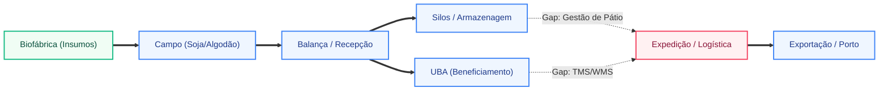

# 🦅 DOSSIÊ SCOUT 360: INTELIGÊNCIA OPERACIONAL - SCHEFFER & CIA LTDA

**🎯 RADAR DE ESTRUTURA E CAPEX**
* **DNA Operacional:** Conglomerado agroindustrial verticalizado, um dos maiores produtores de algodão do Brasil e pioneiro em agricultura regenerativa em larga escala [[1]](https://scheffer.agr.br/quem-somos/).
* **Pegada de Chão:** Opera mais de 210.000 hectares distribuídos em unidades estratégicas no Mato Grosso (Sapezal, Campo Novo do Parecis), Maranhão e Pará [[2]](https://www.noticiasagricolas.com.br/noticias/algodao/317537-grupo-scheffer-e-referencia-em-agricultura-regenerativa-e-producao-de-algodao.html).
* **Infraestrutura Crítica:** Possui rede própria de Unidades de Beneficiamento de Algodão (UBAs) de alta performance, silos de armazenagem de grãos e biofábricas para produção de insumos biológicos [[3]](https://valor.globo.com/agronegocios/noticia/2023/05/15/scheffer-avanca-na-agricultura-regenerativa-e-preve-faturar-r-3-bilhoes.ghtml).
* **Arsenal Logístico/Aéreo:** Frota pesada para escoamento de safra e estrutura de aviação agrícola para manejo de precisão em grandes extensões.
* **O Calcanhar de Aquiles:** Orquestração logística de pátio e transporte (TMS/WMS) para suportar o volume de exportação direta e a complexidade da agricultura regenerativa.

---

### 🔗 MAPA DE ELOS DA CADEIA DE VALOR

| Elo | Status | Evidência | Módulo GAtec |
|-----|--------|-----------|-------------|
| Plantio próprio | ✅ | 210k ha de soja, milho e algodão [[1]](https://scheffer.agr.br/quem-somos/) | SimpleFarm Agro |
| Armazenagem própria | ✅ | Silos e armazéns em todas as unidades produtivas | Operis + balança |
| Beneficiamento (UBA) | ✅ | UBAs próprias para processamento de pluma [[2]](https://www.noticiasagricolas.com.br/noticias/algodao/317537-grupo-scheffer-e-referencia-em-agricultura-regenerativa-e-producao-de-algodao.html) | Controle industrial |
| Industrialização | ❓ | Foco em beneficiamento primário e bioinsumos | Controle industrial + custos |
| Exportação direta | ✅ | Operação de trading própria para mercado asiático e europeu | Commerce Log + OneClick |
| Logística própria (frota) | ✅ | Gestão de frota ativa (confirmado via CRM Senior) | Commerce Log |
| Pecuária / ILP | ✅ | Confinamento e integração lavoura-pecuária [[1]](https://scheffer.agr.br/quem-somos/) | Peccode + Multibovinos |
| Rastreabilidade exigida | ✅ | Certificações BCI, RTRS e agricultura regenerativa [[3]](https://valor.globo.com/agronegocios/noticia/2023/05/15/scheffer-avanca-na-agricultura-regenerativa-e-preve-faturar-r-3-bilhoes.ghtml) | Rastreabilidade |

**Total de elos controlados:** 7 de 8
**Leitura da complexidade:** Operação de altíssima verticalização e complexidade biológica, exigindo integração total entre o campo (GAtec) e o backoffice (ERP Senior), com gap crítico em logística de execução (WMS/TMS).

---

### 🗺️ MAPA DO CAOS OPERACIONAL

---

### 🩸 PONTOS DE FALHA OPERACIONAL

**Ponto de Falha 1: Orquestração de Transporte e Pátio (TMS/WMS)**
* **O Fato:** O CRM interno Senior confirma que a Scheffer **NÃO possui WMS/TMS Senior**, apesar de gerir frota e exportação direta.
* **A Mecânica da Dor:** O escoamento de >200k ha sem um TMS integrado ao ERP gera "pontos cegos" no frete, demurrage em pátios de UBAs e falta de visibilidade em tempo real do custo logístico por tonelada/fardo.
* **Impacto estimado:** ESTIMATIVA de mercado: R$ 1,5M a R$ 3M/ano em ineficiências de frete e custos de espera (demurrage).
* **Conexão com sistema:** Implementação do **Commerce Log (TMS/WMS)** para fechar o ciclo logístico já iniciado com o GAtec Frota.

**Ponto de Falha 2: Rastreabilidade da Agricultura Regenerativa**
* **O Fato:** A Scheffer é líder em agricultura regenerativa, o que exige segregação rigorosa de lotes e comprovação de práticas biológicas [[3]](https://valor.globo.com/agronegocios/noticia/2023/05/15/scheffer-avanca-na-agricultura-regenerativa-e-preve-faturar-r-3-bilhoes.ghtml).
* **A Mecânica da Dor:** Se a rastreabilidade entre a Biofábrica (insumos) e o Talhão (GAtec) não estiver 100% automatizada com o ERP, a empresa corre risco de perda de prêmio de preço na exportação por falha de auditoria.
* **Impacto estimado:** ESTIMATIVA de mercado: Risco de 2% a 5% de deságio no valor da pluma por falta de evidência de conformidade regenerativa.
* **Conexão com sistema:** Fortalecimento do módulo de **Rastreabilidade** e integração profunda GAtec-ERP.

---

### 🔍 DISCREPÂNCIAS OPERACIONAIS

* **Discurso de Inovação vs. Gap Logístico:** A empresa é referência em "Agro 4.0" e biológicos, mas a ausência de um TMS/WMS de classe mundial (Senior) cria um descompasso entre a eficiência do campo e a eficiência da expedição.
* **Escala de Exportação vs. Controle de Pátio:** Com faturamento projetado de R$ 3 bilhões [[3]](https://valor.globo.com/agronegocios/noticia/2023/05/15/scheffer-avanca-na-agricultura-regenerativa-e-preve-faturar-r-3-bilhoes.ghtml), a gestão manual ou por planilhas do fluxo de caminhões nas UBAs é um risco crítico de governança.

---

### 🗡️ GATILHOS DE ABORDAGEM

* **Gatilho 1 (Logística):** *"Scheffer, vocês já dominam a frota com GAtec, mas como está a visibilidade do custo de frete e a gestão de pátio nas UBAs? O Commerce Log da Senior eliminaria os gargalos de expedição que hoje não conversam com o seu ERP."*
* **Gatilho 2 (Regenerativo):** *"Para sustentar o prêmio de preço da agricultura regenerativa, a rastreabilidade precisa ser nativa. Como vocês garantem hoje que o dado da biofábrica chega auditável ao porto sem retrabalho manual?"*
* **Gatilho 3 (Cross-sell):** *"Com 74 módulos Senior ativos, o próximo passo natural para a governança de R$ 3 bi é a digitalização total da logística de escoamento, onde hoje reside o maior potencial de recuperação de margem."*

---

### 🎯 LEITURA ESTRATÉGICA DO MÓDULO

- Operação altamente sofisticada e verticalizada, com domínio completo do ciclo biológico e industrial do algodão.
- A grande oportunidade comercial reside no **cross-sell de Logística (WMS/TMS)** para consolidar a governança de uma empresa que já é "Power User" do ecossistema Senior/GAtec.
[[PORTA_FEED_P:8:HA:210000:CNPJS:38:FAT:R$ 2,4 bi]]
[[PORTA_FEED_O:8:ELOS:Plantio|Armazenagem|Beneficiamento|Exportação|Logística]]
[[PORTA_FEED_R:7:PRESSOES:PRODEIC|Reforma Tributária|LCDPR]]
[[PORTA_FEED_T:8:T1:9:T2:8:T3:8:STACK:Senior ERP|GAtec|HCM]]
[[PORTA_FEED_A:7:A1:7:A2:7:GERACAO:G2]]
[[PORTA_SEG:AGI]]
