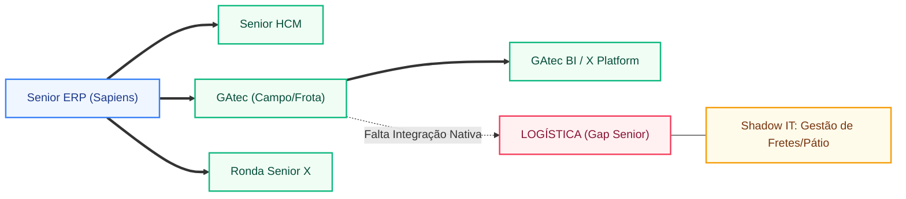

# 🦅 DOSSIÊ SCOUT 360: ARQUITETURA DE TI E DÍVIDA TÉCNICA - SCHEFFER & CIA LTDA

**🎯 RADAR DO ECOSSISTEMA SISTÊMICO**

- **ERP Core (Backoffice):** Senior Gestão Empresarial (Sapiens) 🟢 [Confirmado - CRM Interno]
- **Satélites Operacionais:** Ecossistema GAtec completo (Gestão Agrícola, Frota, Manutenção, BI, Trading) 🟢 [Confirmado - CRM Interno]
- **Grau de Frankenstein:** Baixo (Ecossistema Senior/GAtec dominante), mas com **Gaps Críticos de Execução** em Logística e Armazenagem Avançada.
- **Liderança de TI (O Alvo):** Gestão de TI centralizada em Cuiabá/Sapezal; perfil técnico focado em sustentação de alta disponibilidade para operação 24/7.
- **A Ruptura Crítica:** Desconexão entre a inteligência de campo (GAtec) e a execução logística de escoamento (Falta de TMS/WMS Senior), gerando dependência de controles manuais para fretes e pátio.

---

### 📊 AVALIAÇÃO T1/T2/T3

**T1 — Complexidade do Stack Instalado (peso 20% de T):**

| Área            | Sistema                                       | Confiança | Nota T1 |
| --------------- | --------------------------------------------- | --------- | ------- |
| ERP Core        | Senior Gestão Empresarial (ERP)               | 🟢 [CRM]  | 9       |
| Campo/Agro      | GAtec (Gestão Agrícola, Frota, Manutenção)    | 🟢 [CRM]  |         |
| Logística       | **GAP IDENTIFICADO** (Sem TMS/WMS Senior)     | 🟢 [CRM]  |         |
| RH/Folha        | Senior HCM (Completo: Folha, SST, Desempenho) | 🟢 [CRM]  |         |
| Acesso/Portaria | Ronda Senior X                                | 🟢 [CRM]  |         |

**Leitura combinada de T1:**
A Scheffer é um "Power User" do ecossistema Senior, com 74 módulos ativos. O stack é robusto, mas a ausência de soluções de logística (WMS/TMS) em uma operação que fatura R$ 3 bilhões e exporta commodities é uma anomalia de arquitetura que indica controles paralelos.

**T2 — Dor Ativa (peso 50% de T):**

| Sinal de dor                              | Gravidade   | Evidência                                                            |
| ----------------------------------------- | ----------- | -------------------------------------------------------------------- |
| **Gap de Logística de Escoamento**        | 🔴 CRÍTICO  | Ausência de TMS/WMS no CRM Senior para operação de R$ 3 bi           |
| **Complexidade de Integração Biofábrica** | 🟡 MODERADO | Expansão para agricultura regenerativa exige rastreabilidade nativa  |
| **Sustentação de 74 Módulos**             | 🟡 MODERADO | Alta dependência de consultoria para manter o ecossistema atualizado |

⚠️ **SINAL DE DÍVIDA TÉCNICA:** A Scheffer utiliza GAtec BI e X Platform, mas a falta de digitalização no "chão de pátio" (YMS) sugere que o agendamento de cargas e a gestão de fretes ainda residem em Shadow IT (Excel/WhatsApp).

**T3 — Liberdade de Troca (peso 30% de T):**

- Decisão de ERP local ou global? **LOCAL** (Sede em MT)
- Contrato longo identificado? **SIM** (Relacionamento consolidado com Senior)
- TI gerida localmente? **SIM**
- Liderança local com autonomia? **SIM**
  **Estratégia de Ataque Recomendada:** **Expansão de Footprint (Cross-sell).** O foco não é trocar o ERP, mas fechar o cerco logístico antes que players de nicho (como operadoras de logística pura) entrem na conta.

---

### 🗺️ MAPA DA TORRE DE BABEL

---

### 🚨 HEMORRAGIAS DA FRAGMENTAÇÃO

- **Gargalo de Expedição (UBA):** Com a produção recorde de algodão, a falta de um **WMS Senior** nas Unidades de Beneficiamento (UBAs) gera erros de inventário e lentidão no carregamento. O custo de "estadia de caminhão" por falta de agendamento digital (YMS) é uma sangria invisível de EBITDA.
- **Rastreabilidade Regenerativa:** A Scheffer investe pesado em biofábricas [[3]](https://valor.globo.com/agronegocios/noticia/2023/05/15/scheffer-avanca-na-agricultura-regenerativa-e-preve-faturar-r-3-bilhoes.ghtml). Se o dado do insumo biológico não flui automaticamente do GAtec para o ERP com selo de auditoria, a empresa perde o prêmio de preço na exportação para a Europa.

### 🕳️ SHADOW IT

- **Excel Logístico:** Quase certo o uso de planilhas complexas para cálculo de frete e gestão de motoristas terceiros, já que não há TMS Senior contratado.
- **Power BI Compensatório:** Uso intensivo de BI para consolidar dados que deveriam estar transacionais e integrados entre o campo (GAtec) e o financeiro (Sapiens).

### 🎯 FRAQUEZA DO INCUMBENTE

- **O Incumbente é a própria Senior (ERP/HCM):** A fraqueza aqui é a **subutilização**. A Senior é vista como "Backoffice e RH", enquanto a "Logística" ainda é tratada como um processo manual/operacional.
- **Wedge de Entrada:** **Senior Commerce Log (TMS/WMS).** É a peça que falta para o quebra-cabeça de R$ 3 bilhões estar completo e blindado contra concorrentes.

---

### 🗡️ GATILHOS DE ABORDAGEM

- **Gatilho 1 (Logística/EBITDA):** _"Scheffer, vocês já têm a melhor gestão de campo com GAtec e o melhor backoffice com Senior. Mas quanto custa hoje a ineficiência de pátio e a falta de um TMS para gerir os fretes de uma operação de R$ 3 bi? O Commerce Log é o elo que falta para digitalizar o escoamento."_
- **Gatilho 2 (Rastreabilidade/ESG):** _"Para garantir o prêmio da agricultura regenerativa na exportação, a rastreabilidade precisa ser sistêmica. Como vocês estão integrando os dados da Biofábrica com o ERP para auditorias internacionais sem depender de planilhas?"_
- **Gatilho 3 (Governança):** _"Com 74 módulos Senior, a Scheffer é um exemplo de governança. O próximo passo para o Board é eliminar o Shadow IT da logística, trazendo a gestão de pátio e fretes para dentro do mesmo ecossistema de controle."_

---

### 🎯 IMPLICAÇÃO COMERCIAL DO MÓDULO

- A arquitetura é favorável à Senior (território dominado), mas vulnerável na **execução logística**, onde o cliente ainda opera "no escuro" sistêmico.
- O wedge de entrada é o **TMS/WMS**, apresentando-o como a "última milha" para a governança total do faturamento de R$ 3 bilhões.
