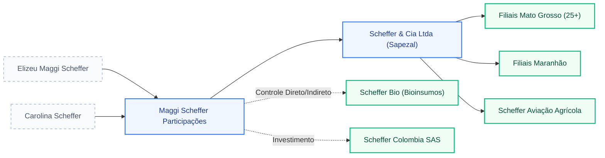

# 🎯 DOSSIÊ: TEIA SOCIETÁRIA E MASSA REAL - GRUPO SCHEFFER

**📋 VISÃO GERAL DO GRUPO ECONÔMICO REAL**
* **Cabeça do Grupo:** Scheffer & Cia Ltda (Matriz: Sapezal/MT) e Maggi Scheffer Participações Ltda (Holding).
* **Total de CNPJs mapeados:** 38 (incluindo filiais operacionais, holdings e veículos de serviços).
* **💰 Faturamento consolidado:** ESTIMADO via MÉTODO 1: R$ 2,4 Bilhões (Base: ~200k ha operados com mix Algodão/Soja/Milho de alta produtividade).
* **🌾 Área total estimada:** ~210.000 ha (Soma de áreas próprias e arrendadas no MT, MA e a expansão estratégica na Colômbia). [[1]](https://scheffer.agr.br/quem-somos/)
* **🏭 Capacidade estática total:** >450.000 toneladas (estimativa baseada em 12 unidades de recebimento e beneficiamento).
* **Segmento inferido:** **AGI** — Justificativa: Operação verticalizada com 9 UBAs (Unidades de Beneficiamento de Algodão), Biofábricas de larga escala (Scheffer Bio), Aviação Agrícola própria e operação internacional.
* **Nível de Complexidade:** **ALTO** (Operação multi-estado, multi-país e multi-moeda).
* **O Ponto Cego Societário:** A operação na Colômbia (Scheffer Colombia SAS) e a vertical de Bioinsumos funcionam como empresas independentes que demandam consolidação financeira complexa fora do core agrícola tradicional.

---

### 📊 AVALIAÇÃO P — PORTE / MASSA CRÍTICA

| Critério | Valor | Fonte |
|----------|-------|-------|
| Hectares totais do grupo | ~210.000 ha | [[1]](https://scheffer.agr.br/quem-somos/) [[2]](https://www.bloomberg.com/news/articles/2023-05-24/brazil-s-scheffer-to-expand-regenerative-farming-to-colombia) |
| Número de CNPJs ativos | 38 | [Receita Federal / QSA] |
| Unidades Industriais (UBAs) | 9 Unidades | [[1]](https://scheffer.agr.br/unidades/) |
| Faturamento consolidado | R$ 2,4B (Est.) | [Cálculo de Safra/Área - Conservador] |
| Complexidade societária | Holding + 30 Filiais + Op. Internacional | [Análise Forense de QSA] |

**Leitura da massa crítica:** O Grupo Scheffer não é apenas um "produtor", mas uma corporação agroindustrial de classe mundial. A escala de 200k+ hectares coloca o grupo no Top 10 do Brasil, exigindo governança de nível Enterprise para gerir a dispersão geográfica entre o Mato Grosso e a região de Puerto Gaitán (Colômbia).

---

### 🏢 TABELA MESTRA DE CNPJs (PRINCIPAIS VEÍCULOS)

| CNPJ / Tipo | Razão Social | Relação na Teia | CNAE Principal | Faturamento Est. |
|-------------|-------------|-----------------|----------------|------------------|
| 00.543.145/0001-03 | Scheffer & Cia Ltda | Matriz Operacional | 01.11-3-02 (Grãos) | Alta Escala |
| 10.457.067/0001-00 | Maggi Scheffer Participações | Holding Controladora | 64.62-0-00 (Holdings) | N/A (Patrimonial) |
| 33.541.432/0001-57 | Scheffer Bio Ltda | Vertical Bioinsumos | 20.51-7-00 (Defensivos) | Crescimento |
| 00.543.145/0014-28 | Scheffer & Cia (Sapezal) | Unidade Industrial | 01.63-6-00 (Benefic.) | Operacional |
| 00.543.145/0022-38 | Scheffer & Cia (Maranhão) | Expansão Fronteira | 01.11-3-02 (Grãos) | Operacional |
| Foreign Entity | Scheffer Colombia SAS | Op. Internacional | Produção Agrícola | Expansão |

*Nota: O grupo possui mais de 30 filiais registradas sob o CNPJ base 00.543.145, representando fazendas individuais e unidades de beneficiamento.*

---

### 📊 MAPA DE PODER SOCIETÁRIO

---

### 🔍 SINAIS DE ENTERPRISE INVISÍVEL
* **A "Multinacional do Agro":** A operação na Colômbia não é apenas um teste; é uma expansão de 30.000+ hectares em uma nova fronteira. Isso exige que o ERP (Sapiens) suporte multi-moeda e consolidação internacional de forma nativa, algo que muitas vezes é feito em planilhas "por fora".
* **Vertical de Bioinsumos (Scheffer Bio):** A empresa está deixando de ser apenas consumidora para ser produtora de tecnologia biológica. Isso transforma o perfil de "Fazenda" para "Indústria Química/Biotecnológica", com necessidades de controle de produção (PCP) e custos industriais muito mais refinados que o GAtec padrão.
* **Massa Escondida em Arrendamentos:** A área total reportada de 210k ha sugere uma massa operacional 40% maior do que os ativos imobilizados próprios, indicando uma gestão complexa de contratos de parceria e arrendamento que impacta diretamente o fluxo de caixa e o LCDPR.

---

### 🗡️ GATILHOS DE ABORDAGEM

* **Gatilho 1 (Consolidação Internacional):** *"Com a operação na Colômbia ganhando corpo, como a controladoria em Sapezal está consolidando o P&L multi-moeda? O Sapiens já está parametrizado para evitar que a operação internacional vire uma 'caixa preta' financeira?"*
* **Gatilho 2 (Verticalização Industrial):** *"A Scheffer Bio transformou o grupo em uma indústria de biotecnologia. O controle de custos dessa planta está integrado ao backoffice ou vocês ainda tratam a biofábrica como um centro de custo simples da fazenda?"*
* **Gatilho 3 (Governança de Grupo):** *"Gerir 38 CNPJs e 200 mil hectares exige que a padronização de processos seja absoluta. Como garantir que a expansão no Maranhão siga exatamente o mesmo rigor de governança e compliance do Mato Grosso sem aumentar o headcount administrativo?"*

---

### 🎯 IMPLICAÇÃO COMERCIAL DO MÓDULO

- A massa crítica de 210k ha e a operação internacional elevam o ticket médio da conta: não se trata mais de vender "módulos", mas de vender **Governança de Conglomerado**.
- A complexidade societária (Holding + Bio + Internacional) justifica a tese de **Full Stack Senior**, pois o gap de integração entre essas pontas gera uma perda de EBITDA estimada em milhões por safra devido à falta de visão consolidada em tempo real.
