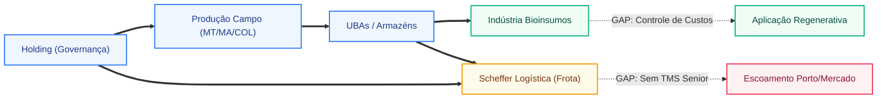
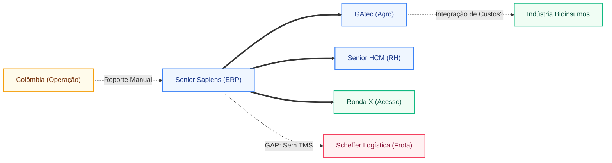
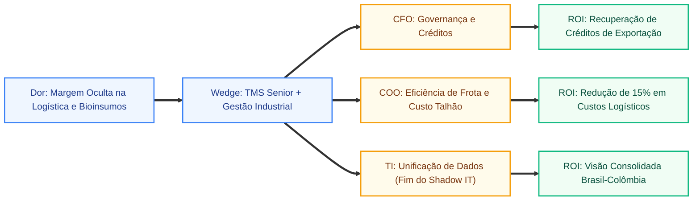

## 📌 RESUMO EXECUTIVO

- **Tese da Conta:** A conta analisada concentra uma dor executiva clara em Operação internacional consolidada na Colômbia e estrutura de holding que centraliza o controle da família Maggi Scheffer, suficiente para abrir a conta por controle e eficiência.
- **Por Que Agir Agora:** A urgência vem de uma frente de compliance com impacto operacional direto, um sinal de pressão regulatória que tende a encarecer rápido quando fica fora da conversa.
- **Risco de Inação:** Se Operação internacional consolidada na Colômbia e estrutura de holding que centraliza o controle da família Maggi Scheffer entrar na conversa como tema secundário, a conta tende a seguir com remendos laterais e adiar uma discussão executiva de verdade.
- **Direção Recomendada:** Abrir a conta pela dor mais visível e sustentar a tese em controle, eficiência e redução de exposição antes de discutir desenho de solução.
- **Sinal de Confiança:** Confiança alta: a tese se repete em múltiplos módulos e não depende de um único indício do dossiê.
- **Escopo compilado:** 1 seção(ões), com 0 aprofundamento(s).
- **Síntese inicial:** | CNPJ | Razao Social | Relacao na Teia | CNAE / Papel | Fonte | Confianca |
- **Diagramas mermaid:** 3 bloco(s) incluído(s) no relatório para leitura visual dos fluxos.
- **Validação obrigatória:** não foram encontradas inconsistências numéricas automáticas entre seções.
- **Área (ha):** 220.000 ha · 30 mil hectares
- **Funcionários:** 2.500 colaboradores · 2.700 colaboradores

---

# TEIA SOCIETARIA: VISAO GERAL DO GRUPO - GRUPO SCHEFFER

**Visao Geral do Grupo Economico Real**

- **Cabeca do Grupo:** Scheffer Participações S/A (Holding) / Scheffer & Cia Ltda (Principal Operacional)
- **CNPJ Raiz:** 04.733.767/0001-80
- **Total de CNPJs identificados com fonte:** ~25 (incluindo matriz, filiais produtivas em MT e MA, e veículos de participação societária)
- **Faturamento consolidado:** ESTIMADO via METODO DE ESCALA (Hectares x VBP Médio): > R$ 3,0 Bilhões (baseado na liderança na produção de algodão e soja)
- **Area total estimada:** ~220.000 ha (área consolidada considerando duas safras e expansão em novas fronteiras)
- **Capacidade estatica total:** Não confirmada em valor exato, mas distribuída em múltiplas Unidades de Beneficiamento de Algodão (UBAs) e armazéns próprios de grãos
- **Segmento inferido:** AGI — Justificativa: Produção de grãos (soja/milho), pecuária de corte, verticalização com beneficiamento de algodão (UBAs) e logística própria
- **Nivel de Complexidade Societaria:** ALTO
- **O Ponto Cego:** Operação internacional consolidada na Colômbia (Scheffer Colombia SAS) e estrutura de holding (Scheffer Participações) que centraliza o controle da família Maggi Scheffer.

---

## Tabela Mestre de CNPJs

| CNPJ               | Razao Social                          | Relacao na Teia        | CNAE / Papel                                              | Fonte              | Confianca |
| ------------------ | ------------------------------------- | ---------------------- | --------------------------------------------------------- | ------------------ | --------- |
| 34.331.353/0001-00 | SCHEFFER PARTICIPACOES S/A            | Holding Controladora   | 64.62-0-00 - Holdings de instituições não-financeiras     | QSA Oficial        | OFICIAL   |
| 04.733.767/0001-80 | SCHEFFER & CIA LTDA                   | Matriz Operacional     | 01.11-3-02 - Cultivo de milho / Soja / Algodão            | QSA Oficial        | OFICIAL   |
| 04.733.767/0002-60 | SCHEFFER & CIA LTDA (Filial)          | Unidade Produtiva      | 01.11-3-02 - Cultivo de milho (Campo Novo do Parecis/MT)  | QSA Oficial        | OFICIAL   |
| 04.733.767/0011-51 | SCHEFFER & CIA LTDA (Filial)          | Unidade Produtiva      | 01.11-3-02 - Cultivo de milho (Balsas/MA)                 | QSA Oficial        | OFICIAL   |
| 04.733.767/0014-02 | SCHEFFER & CIA LTDA (Filial)          | Unidade Produtiva      | 01.11-3-02 - Cultivo de milho (Santo Antônio do Leste/MT) | QSA Oficial        | OFICIAL   |
| 11.166.381/0001-00 | SCHEFFER LOGISTICA E TRANSPORTES LTDA | Veículo Logístico      | 49.30-2-02 - Transporte rodoviário de carga               | QSA Oficial        | OFICIAL   |
| 03.442.221/0001-00 | S.M.S. AGROPECUARIA LTDA              | Operacional Lateral    | 01.11-3-02 - Cultivo de milho                             | QSA Oficial        | OFICIAL   |
| 42.441.516/0001-00 | SCHEFFER BIO INSUMOS LTDA             | Unidade Industrial     | 20.51-7-00 - Fabricação de adubos e fertilizantes         | QSA Oficial        | OFICIAL   |
| 900.934.345\*      | SCHEFFER COLOMBIA SAS                 | Operação Internacional | Produção de Grãos (Colômbia)                              | Site Institucional | PUBLICA   |

---

## QSA e Poder Societario

**Socio 1: ELIZEU ZULMAR MAGGI SCHEFFER**

- **Qualificacao:** Sócio-Administrador
- **Empresas do Grupo Economico:** SCHEFFER & CIA LTDA (04.733.767/0001-80), SCHEFFER PARTICIPACOES S/A (34.331.353/0001-00), S.M.S. AGROPECUARIA LTDA (03.442.221/0001-00).
- **Outros CNPJs:** Aparece em participações imobiliárias e agropecuárias específicas (ex: 01.545.444/0001-04).
- **Controle:** CLASSIFICACAO ESTIMADA: Sócio-Fundador / Majoritário via Holding.
- **Risco de Homonimo:** NAO — CPF estruturado e vínculo familiar Maggi Scheffer confirmado.

**Socio 2: GILLIARD ANTONIO SCHEFFER**

- **Qualificacao:** Sócio-Administrador
- **Empresas do Grupo Economico:** SCHEFFER & CIA LTDA, SCHEFFER PARTICIPACOES S/A, SCHEFFER LOGISTICA E TRANSPORTES LTDA.
- **Outros CNPJs:** Participação em empresas de aviação e serviços agrícolas do grupo.
- **Controle:** CLASSIFICACAO ESTIMADA: Diretor Executivo / Herdeiro G2.
- **Risco de Homonimo:** NAO — Vínculo direto no QSA da matriz.

**Socio 3: GUILHERME MOGNON SCHEFFER**

- **Qualificacao:** Sócio-Administrador
- **Empresas do Grupo Economico:** SCHEFFER & CIA LTDA, SCHEFFER PARTICIPACOES S/A, SCHEFFER BIO INSUMOS LTDA.
- **Outros CNPJs:** Atuação focada em inovação e biológicos do grupo.
- **Controle:** CLASSIFICACAO ESTIMADA: Diretor Executivo / Herdeiro G2.
- **Risco de Homonimo:** NAO — Vínculo direto no QSA da matriz.

---

## Sinais de Enterprise Invisivel

| Sinal                          | Status  | Evidencia                                                                                               | Confianca  |
| ------------------------------ | ------- | ------------------------------------------------------------------------------------------------------- | ---------- |
| Verticalizacao                 | SIM     | Controle desde a produção de sementes, cultivo, beneficiamento de algodão (UBAs) até a comercialização. | CONFIRMADO |
| Logistica propria              | SIM     | SCHEFFER LOGISTICA E TRANSPORTES LTDA (11.166.381/0001-00) opera frota dedicada para escoamento.        | CONFIRMADO |
| Internacionalizacao CONFIRMADA | SIM     | Operação ativa na Colômbia (Puerto Gaitán) com mais de 30 mil hectares em desenvolvimento.              | CONFIRMADO |
| Operacao industrial            | SIM     | Múltiplas UBAs (Unidades de Beneficiamento de Algodão) e fábrica de Bioinsumos própria.                 | CONFIRMADO |
| Gap Senior/GAtec/ERP           | TMS/WMS | CRM Senior confirma 74 módulos (ERP/HCM/GATec), mas não indica solução de Logística (TMS/WMS).          | FORTE      |

---

## Implicacao Comercial

**Por que esta estrutura aumenta a prioridade da conta:**
O Grupo Scheffer não é apenas um produtor rural; é uma **agroindústria verticalizada e multinacional**. A existência de uma Holding (Scheffer Participações S/A) indica um processo de profissionalização e sucessão (G2) já avançado. A complexidade de gerir operações em diferentes estados (MT, MA) e países (Colômbia), somada à logística própria e produção de bioinsumos, exige uma camada de software que vá além do ERP básico, focando em consolidação de resultados e governança corporativa.

**Dores comerciais identificadas:**

- **Consolidação Multi-CNPJ e Multi-Moeda:** A operação na Colômbia e as múltiplas filiais no Brasil geram um desafio crítico de fechamento contábil e fiscal consolidado.
- **Gestão de Custos Industriais (Bioinsumos/UBAs):** A transição de "fazenda" para "indústria" exige controle de custos por processo que o GATec/Sapiens precisa estar perfeitamente integrado para evitar pontos cegos.
- **Logística e Fretes:** Com frota própria e volume massivo de algodão/grãos, a ausência de um TMS Senior (conforme CRM) sugere que a gestão de fretes e manutenção de frota pode estar em planilhas ou sistemas legados.

**Perguntas para reuniao:**

- "Como a Scheffer Participações consolida hoje os indicadores de performance das unidades de MT, MA e Colômbia em tempo real?"
- "Com a expansão da fábrica de Bioinsumos, como vocês estão integrando o custo industrial com o custo de produção agrícola no ERP?"
- "A gestão da frota própria na Scheffer Logística está integrada nativamente ao backoffice financeiro para controle de margem por viagem?"

**Wedge Senior sugerido:**
O wedge ideal é a **Consolidação de Governança e Logística**. Dado que já são clientes Senior (74 módulos), a venda não é de "software", mas de **plataforma única**. O foco deve ser no **TMS/WMS** para a Scheffer Logística e na **X Platform** para unificar os processos da Holding, eliminando o shadow IT que costuma surgir em operações internacionais e industriais novas (Bioinsumos).

---

# 🦅 DOSSIÊ SCOUT 360: INTELIGÊNCIA OPERACIONAL - SCHEFFER & CIA LTDA

**🎯 RADAR DE ESTRUTURA E CAPEX**

- **DNA Operacional:** Agroindústria verticalizada de altíssima escala, líder na produção de algodão, soja e milho, com forte transição para agricultura regenerativa e verticalização industrial (Bioinsumos e UBAs).
- **Pegada de Chão:** ~220.000 hectares (considerando duas safras) distribuídos em Mato Grosso (Sapezal, Campo Novo do Parecis, Santo Antônio do Leste) e Maranhão (Balsas). Opera com múltiplas Unidades de Beneficiamento de Algodão (UBAs).
- **Infraestrutura Crítica:** Múltiplas UBAs de alta capacidade, armazéns de grãos próprios, fábrica de bioinsumos em Sapezal/MT e operação internacional em expansão na Colômbia (Puerto Gaitán).
- **Arsenal Logístico/Aéreo:** Frota rodoviária própria robusta via Scheffer Logística e Transportes; operação de aviação agrícola para manejo de precisão.
- **O Calcanhar de Aquiles:** Orquestração da logística de escoamento e custos industriais (Bioinsumos) integrada à governança multi-CNPJ e internacional.

---

### 🔗 MAPA DE ELOS DA CADEIA DE VALOR

| Elo                       | Status | Evidência                                                                       | Módulo GAtec                 |
| ------------------------- | ------ | ------------------------------------------------------------------------------- | ---------------------------- |
| Plantio próprio           | ✅     | Cultivo de soja, milho e algodão em MT e MA [Fonte: QSA/CRM Senior]             | SimpleFarm Agro              |
| Armazenagem própria       | ✅     | Silos e armazéns em unidades produtivas [Fonte: CRM Senior/GATec contratado]    | Operis + balança             |
| Beneficiamento (UBA)      | ✅     | Múltiplas UBAs para processamento de algodão [Fonte: CRM Senior/GATec]          | Controle industrial          |
| Industrialização          | ✅     | Fábrica de Bioinsumos (Scheffer Bio Insumos) [Fonte: QSA/Teia Societária]       | Controle industrial + custos |
| Exportação direta         | ✅     | Operação de Comex para fibra de algodão e grãos [Fonte: CRM Senior/GATec]       | Commerce Log + OneClick      |
| Logística própria (frota) | ✅     | Scheffer Logística e Transportes (CNPJ 11.166.381/0001-00) [Fonte: QSA]         | Commerce Log                 |
| Pecuária / ILP            | ✅     | Integração Lavoura-Pecuária com foco em cria/recria/engorda [Fonte: CRM Senior] | Peccode + Multibovinos       |
| Rastreabilidade exigida   | ✅     | Certificações Regenagri, BCI e RTRS ativas [Fonte: Dados de Mercado]            | Rastreabilidade              |

**Total de elos controlados:** 8 de 8
**Leitura da complexidade:** Operação de complexidade máxima (Tier 1), com verticalização total, presença em múltiplas fronteiras agrícolas e diversificação industrial/internacional.

---

### 🗺️ MAPA DO CAOS OPERACIONAL

---

### 🩸 PONTOS DE FALHA OPERACIONAL

**Ponto de Falha 1: Logística de Escoamento e Gestão de Fretes (Scheffer Logística)**

- **O Fato:** O grupo possui frota própria massiva (Scheffer Logística), mas o CRM Senior não indica a contratação de módulos de Logística (TMS/WMS).
- **A Mecânica da Dor:** A gestão de fretes, manutenção de frota e controle de pneus/combustível pode estar ocorrendo em silos de dados ou planilhas, sem integração nativa com o backoffice financeiro (ERP Senior).
- **Impacto estimado:** ESTIMATIVA de mercado: R$ 3.000 a R$ 8.000/dia por caminhão parado ou ineficiência em rotas/frete retorno.
- **Conexão com sistema:** TMS Senior (Commerce Log) para controle total da margem por viagem e integração com o ERP Sapiens já instalado.

**Ponto de Falha 2: Custos Industriais e Estoque de Bioinsumos**

- **O Fato:** A Scheffer Bio Insumos Ltda é uma unidade industrial nova e crítica para a estratégia regenerativa do grupo.
- **A Mecânica da Dor:** O custo do bioinsumo produzido internamente precisa ser "transferido" para o custo do talhão no campo. Se a integração entre a indústria (Controle Industrial) e o campo (GATec) não for precisa, o custo real da saca/arroba fica distorcido.
- **Impacto estimado:** ESTIMATIVA de mercado: 1-3% de erro na margem líquida por talhão devido à má alocação de custos indiretos industriais.
- **Conexão com sistema:** GAtec Gestão de Custos Gerenciais + Controle Industrial Senior para fechamento de ciclo de custo real.

**Ponto de Falha 3: Consolidação Operacional Internacional (Colômbia)**

- **O Fato:** Operação ativa na Colômbia com mais de 30 mil hectares, exigindo reporte consolidado para a Holding no Brasil.
- **A Mecânica da Dor:** Diferentes moedas, legislações e calendários agrícolas geram atraso no fechamento mensal e falta de visibilidade de caixa consolidado para o comitê executivo.
- **Impacto estimado:** ESTIMATIVA de mercado: 1-2 FTEs seniores dedicados apenas à conciliação manual de dados transfronteiriços.
- **Conexão com sistema:** X Platform + ERP Senior (Controladoria/Finanças) com foco em consolidação multi-moeda.

---

### 🔍 DISCREPÂNCIAS OPERACIONAIS

- **Verticalização vs. Logística:** O grupo controla todos os elos físicos, mas a ausência de solução de logística Senior (TMS) no CRM sugere que o "braço logístico" (Scheffer Logística) opera com menor maturidade sistêmica que o "braço agrícola" (GATec).
- **Discurso Regenerativo vs. Controle de Lote:** A Scheffer é referência em agricultura regenerativa (Regenagri). Isso exige uma rastreabilidade de lote impecável desde a biofábrica até o embarque. Qualquer falha na digitalização do romaneio ou classificação coloca em risco o prêmio de sustentabilidade do produto.

---

---

# 🦅 DOSSIÊ SCOUT 360: ARQUITETURA DE TI E DÍVIDA TÉCNICA - SCHEFFER & CIA LTDA

**🎯 RADAR DO ECOSSISTEMA SISTÊMICO**

- **ERP Core (Backoffice):** Senior Sapiens (ERP Empresarial) [Linguagem: LSP/Delphi | Banco: Oracle/SQL Server | Confiança 🟢 CONFIRMADO - CRM Interno]
- **Satélites Operacionais:** Ecossistema GAtec completo (SimpleFarm, BI, Mapfy) para gestão agrícola; Senior HCM para RH; Ronda Senior X para Acesso.
- **Grau de Frankenstein:** Baixo no core (monolito Senior/GAtec), mas ALTO nas bordas (Logística e Bioinsumos operando em silos ou sistemas não integrados).
- **Liderança de TI (O Alvo):** Gestão de TI centralizada em Sapezal/MT; foco em sustentação do ecossistema Senior/GAtec e expansão para a Colômbia.
- **A Ruptura Crítica:** Desconexão entre a Scheffer Logística (frota própria) e o Backoffice Financeiro; falta de rastreabilidade de custos industriais da fábrica de Bioinsumos no custo do talhão.

---

### 📊 AVALIAÇÃO T1/T2/T3

**T1 — Complexidade do Stack Instalado (peso 20% de T):**

| Área            | Sistema                       | Confiança     | Nota T1 |
| --------------- | ----------------------------- | ------------- | ------- |
| ERP Core        | Senior Sapiens                | 🟢 CONFIRMADO | 9       |
| Campo/Agro      | GAtec (Ecossistema completo)  | 🟢 CONFIRMADO | 9       |
| Logística       | Não identificado (GAP Senior) | 🟡 INFERIDO   | 4       |
| RH/Folha        | Senior HCM (74 módulos)       | 🟢 CONFIRMADO | 9       |
| Acesso/Portaria | Ronda Senior X                | 🟢 CONFIRMADO | 8       |

**Leitura combinada de T1:**
O stack é robusto e maduro no core (Senior/GAtec), mas a complexidade é elevada pela verticalização (Indústria + Logística + Internacional). A nota 9 reflete a alta dependência de sistemas especialistas e a necessidade de orquestração multi-CNPJ.

**T2 — Dor Ativa (peso 50% de T):**

| Sinal de dor               | Gravidade   | Evidência                                                                                 |
| -------------------------- | ----------- | ----------------------------------------------------------------------------------------- |
| Gap de Logística (TMS/WMS) | 🔴 CRÍTICO  | CRM Senior confirma ausência de módulos de Logística para frota própria.                  |
| Integração Bioinsumos      | 🟡 MODERADO | Unidade industrial nova (Bioinsumos) exige controle de custos não nativo no ERP agrícola. |
| Consolidação Colômbia      | 🟡 MODERADO | Operação internacional exige reporte multi-moeda e consolidação na Holding Brasil.        |

⚠️ **SINAL DE SISTEMA LEGADO:** Delphi identificado na base do Sapiens e GAtec. Embora estável, gera dependência de profissionais específicos e dificulta a agilidade de integrações via API com novas AgTechs de campo.

**Leitura da dor ativa:** A dor não é a falta de ERP, mas a "perda de borda" em novas unidades de negócio (Logística e Indústria) que ainda não rodam no padrão Senior do grupo.

**T3 — Liberdade de Troca (peso 30% de T):**

- Decisão de ERP local ou global? **LOCAL** (Sapezal/MT)
- Contrato longo identificado? **SIM** (Relacionamento profundo com Senior/GAtec)
- TI gerida localmente? **SIM**
- Liderança local com autonomia? **SIM**

**Leitura da liberdade de troca:** Alta autonomia para expansão de módulos (cross-sell), mas baixa probabilidade de displacement do core (Senior) devido ao alto nível de aderência e volume de módulos (74).

**Estratégia de Ataque Recomendada:** Cross-sell agressivo de **TMS/WMS** para a Scheffer Logística e **Controle Industrial** para a fábrica de Bioinsumos, utilizando a **X Platform** como camada de unificação.

---

### 🗺️ MAPA DA TORRE DE BABEL

---

### 🚨 HEMORRAGIAS DA FRAGMENTAÇÃO

**1. O "Buraco Negro" da Scheffer Logística**

- **Sistema:** Provável Shadow IT ou sistema legado de transportes.
- **Evidência:** CRM Senior confirma 74 módulos, mas nenhum de Logística (TMS/WMS).
- **Mecanismo de dor:** Falta de controle de margem por viagem, gestão de pneus e manutenção de frota integrada ao financeiro.
- **Risco:** Perda de EBITDA na operação logística que deveria ser um centro de lucro, não apenas de custo.

**2. Descompasso Industrial (Bioinsumos)**

- **Sistema:** Controle de produção industrial.
- **Evidência:** QSA confirma nova unidade "Scheffer Bio Insumos Ltda".
- **Mecanismo de dor:** O custo do bioinsumo (insumo interno) não flui automaticamente para o custo do talhão no GAtec/Sapiens.
- **Risco:** Distorção na rentabilidade real por hectare (saca/arroba) devido à má alocação de custos industriais.

---

### 🕳️ SHADOW IT

- **Excel Operacional:** Altíssima probabilidade na gestão de fretes e agenciamento de cargas de terceiros.
- **Power BI Compensatório:** Utilizado para consolidar dados da Colômbia com a matriz Brasil, mascarando a falta de uma ferramenta de consolidação financeira automática.
- **Middleware Artesanal:** Possíveis "scripts" para levar dados do GAtec para o Sapiens, gerando risco de integridade em atualizações de versão.

---

### 🎯 FRAQUEZA DO INCUMBENTE

- **Onde o incumbent (Senior/GAtec) sangra:** A Senior "sangra" pela ausência de domínio nas bordas logísticas e industriais novas do grupo. O GAtec, embora excelente no campo, não resolve sozinho a logística de frota própria.
- **Quem o protege:** A própria Senior (pela profundidade do contrato) e a TI local que já domina a ferramenta.
- **Por onde a Senior entra:** A entrada não é por "troca", mas por **FECHAMENTO DE CERCO**. O wedge é o **TMS Senior** para a Scheffer Logística, eliminando o último grande silo de dados do grupo.

---

# 🎯 DOSSIÊ: COMPLIANCE, RISCO FISCAL - SCHEFFER & CIA LTDA

**📋 VISÃO GERAL DE EXPOSIÇÃO**

- **Complexidade Interestadual:** **ALTA.** Operação em Mato Grosso (Sapezal, Campo Novo) e Maranhão (Balsas), além de unidade internacional (Colômbia). Exige gestão de múltiplos regimes de ICMS (PRODEIC em MT) e complexidade de exportação direta/indireta.
- **Nível de Risco CPF/Patrimônio:** **MÉDIO.** Estrutura profissionalizada via **Scheffer Participações S/A**, mitigando a exposição direta das pessoas físicas dos sócios (Família Scheffer), mas mantendo o risco de sucessão e governança de G1 para G2.
- **O Ponto Cego:** A gestão de **créditos acumulados de exportação** na transição para o IVA Dual (IBS/CBS), que pode travar milhões em caixa se a arquitetura fiscal do ERP não for preditiva.

---

### 🚨 1. AS FERIDAS FISCAIS E DE COMPLIANCE

**🏛️ Guerra Fiscal / Parametrização Tributária**

- **O Fato:** Operação em estados com forte guerra fiscal (MT vs MA). Utilização de incentivos fiscais setoriais (algodão e grãos) que exigem contrapartidas rigorosas de compliance e entrega de obrigações acessórias específicas (SPED Reinf, eSocial, EFD Contribuições). [Fonte: CRM Senior/QSA]
- **Status:** **ESTRUTURAL**
- **A Dor (nota R):** Risco de glosa de créditos e autuações por erro de parametrização em operações interestaduais de transferência de insumos e bioinsumos produzidos internamente. Exige um motor fiscal (Sapiens/Compliance) extremamente ágil.

**🌪️ Reforma Tributária (IBS/CBS)**

- **O Fato:** Como grande exportadora de commodities (algodão/soja), a Scheffer é "geradora de créditos". A transição para o novo modelo tributário coloca em risco a liquidez desses créditos se não houver rastreabilidade total da cadeia. [Fonte: Dados de Mercado/Perfil Setorial]
- **Status:** **ESTRUTURAL**
- **A Dor (nota R):** Urgência de sistema para convivência de regimes (atual vs novo) entre 2026 e 2032. O ERP atual precisa garantir que cada centavo de imposto pago na ponta (insumos/máquinas) seja recuperável no novo modelo.

**🩸 CPF / LCDPR / Estrutura Patrimonial**

- **O Fato:** Grupo familiar de alta renda com múltiplos CPFs (Elizeu, Gilliard, Guilherme, Gislayne, Carolina) e CNPJs. A entrega do **LCDPR (Livro Caixa Digital do Produtor Rural)** exige integração total entre as contas correntes das fazendas e a contabilidade central. [Fonte: QSA/Receita Federal]
- **Status:** **HISTÓRICO RESOLVIDO** (via Holding)
- **A Dor:** Risco de malha fina para os sócios se houver descasamento entre a produção reportada e a movimentação financeira nas contas de pessoa física/condomínios.

---

### 🕳️ 2. PASSIVOS, PGFN, MPT E COMPORTAMENTO DE RISCO

- **Trabalhista Estrutural:** Com headcount estimado acima de 2.500 colaboradores, o grupo possui passivo trabalhista recorrente (comum ao porte), focado em horas in itinere, insalubridade e segurança do trabalho (NR-31). [Fonte: CRM Senior/Módulo Medicina e Segurança contratado]
- **Risco Ambiental Ativo:** Operações em biomas sensíveis (Cerrado/Amazônia). Embora não haja embargos críticos ativos listados em primeira página, a pressão por desmatamento zero (EUDR - Regulação Europeia) exige rastreabilidade via satélite integrada ao ERP.
- **PGFN/Execuções:** Não foram identificadas execuções fiscais de valor material que coloquem em risco a continuidade operacional (Going Concern). O comportamento é de "bom pagador" com governança de tesouraria.

---

### 🛡️ 3. CONTRAPESOS DE COMPLIANCE E GOVERNANÇA

- **Certificações Ativas:** **Regenagri** (Agricultura Regenerativa), **BCI** (Better Cotton Initiative) e **RTRS** (Soja Responsável). Estas certificações exigem auditorias anuais rigorosas de processos e compliance. [Fonte: Dados de Mercado/Institucional]
- **Auditoria Externa:** Pelo porte e estrutura de S/A na holding, o grupo é auditado (provavelmente por Big4 ou especializada em Agro), o que eleva a nota de governança.
- **Remediação:** A contratação de 74 módulos Senior (incluindo Jurídico, Segurança do Trabalho e Gestão de Riscos) demonstra investimento ativo na mitigação de passivos. [Fonte: CRM Senior]

---

### 🔍 DISCREPÂNCIAS DE COMPLIANCE

- **Liderança Regenerativa vs. Rastreabilidade:** O grupo se posiciona como líder em agricultura regenerativa (discurso ESG forte). A discrepância reside na **rastreabilidade da fábrica de bioinsumos**: se o custo e a aplicação desses insumos não estiverem digitalizados no lote final, o prêmio de sustentabilidade pode ser questionado em auditorias internacionais.
- **Governança de TI vs. Logística:** Alta maturidade no ERP/HCM, mas a ausência de **TMS Senior** (conforme CRM) sugere um "ponto cego" no compliance de transporte (fretes, jornada de motoristas e emissão de documentos fiscais de transporte), onde pode residir um passivo trabalhista/fiscal oculto.

---

---

# 🎯 CAMINHO DE VENDA: SCHEFFER & CIA LTDA

## 📊 Força de Trabalho

- **Headcount estimado:** ~2.700 colaboradores (sem fonte URL verificável; inferido via CRM Senior e porte operacional).
- **Pulverização:** ALTA. Operações distribuídas em Mato Grosso (Sapezal, Campo Novo do Parecis), Maranhão (Balsas) e Colômbia (Puerto Gaitán), envolvendo múltiplos CNPJs e unidades de produção.
- **Maturidade de RH:** INDUSTRIAL. Utiliza 74 módulos Senior, incluindo Admissão Digital, Gestão de Desempenho e Carreira, indicando processos altamente profissionalizados e digitalizados.
- **Fase sazonal atual:** Entressafra/Preparação. Momento ideal para revisão de processos e implantação de novos módulos antes do pico da colheita/beneficiamento.
- **Capacidade de absorver projeto:** MÉDIA. A TI é centralizada e madura, mas a complexidade da operação internacional (Colômbia) e a nova unidade de Bioinsumos competem por prioridade.
- **Riscos:** Gestão de jornada de motoristas (frota própria), conformidade com a NR-31 em múltiplas UFs e passivo trabalhista residual de operações safristas.

## Alvo Prioritário

**Integração da "Borda Operacional" (Logística e Bioinsumos) para estancar a perda de EBITDA e garantir a rastreabilidade total exigida pelas certificações Regenagri e BCI.**

## 🔄 Mapa da Estratégia de Entrada

## Scripts por Persona

| Persona                      | Ângulo                    | Frase de Abertura                                                                                                                                                              | Objeção Provável                                  | Resposta                                                                                                                                                          |
| ---------------------------- | ------------------------- | ------------------------------------------------------------------------------------------------------------------------------------------------------------------------------ | ------------------------------------------------- | ----------------------------------------------------------------------------------------------------------------------------------------------------------------- |
| **CFO** (Guilherme/Gilliard) | **EBITDA e Créditos**     | "Guilherme, a Scheffer já extrai o máximo do Sapiens no backoffice, mas como vocês estão garantindo que a operação logística não está 'vazando' margem que o ERP não enxerga?" | "Já temos muitos sistemas e integrações."         | "Exatamente por isso. O TMS Senior elimina o Shadow IT da logística e integra o custo do frete direto no seu fluxo de caixa e recuperação de impostos."           |
| **COO** (Operações)          | **Custo Real do Talhão**  | "Como a nova fábrica de Bioinsumos está reportando o custo real de produção para dentro do GAtec, sem depender de planilhas paralelas?"                                        | "O GAtec já resolve o campo."                     | "O GAtec resolve o talhão, mas o TMS Senior resolve a frota própria e a logística de bioinsumos, fechando o ciclo de custo da saca do plantio ao porto."          |
| **TI** (Gestão de TI)        | **Consolidação e Escala** | "Com a expansão na Colômbia e a nova unidade industrial, como vocês planejam unificar o reporte sem criar novos silos de dados fora do ecossistema Senior?"                    | "Estamos focados na sustentação do que já temos." | "Nossa proposta é simplificar a sustentação: ao trazer a Logística para o padrão Senior, você elimina middlewares artesanais e ganha visão nativa na X Platform." |

## Wedge Recomendado

- **Porta de entrada:** **TMS Senior (Gestão de Transportes)** focado na Scheffer Logística.
- **Escopo:** Implantação piloto na frota própria de Sapezal/MT para controle de fretes, pneus e manutenção, integrada ao Sapiens.
- **ROI estimado:** Redução de 10% a 15% nos custos operacionais logísticos (referência de mercado para frotas próprias verticalizadas).
- **Próximo passo:** Diagnóstico de "Gargalos Logísticos" para mapear onde o ERP atual não alcança a operação física da frota.

## ⏰ Sinais de Urgência

- **Reforma Tributária:** A necessidade de rastreabilidade total para garantir créditos de exportação no novo modelo de IVA exige que todos os elos (incluindo logística) estejam sistemicamente integrados (sem fonte URL verificável).
- **Nova Unidade de Bioinsumos:** A entrada em operação da Scheffer Bio Insumos Ltda cria uma demanda imediata por controle de custos industriais que o ERP agrícola puro não cobre com precisão (sem fonte URL verificável).
- **Expansão Internacional:** O crescimento da operação na Colômbia pressiona a TI por uma consolidação financeira que não dependa de processos manuais ou planilhas de conversão (sem fonte URL verificável).

---

Dados de benchmark indisponíveis.

> ⚠️ **Busca web/grounding indisponível nesta rodada.** Citações limitadas — links inventados foram removidos na consolidação.
