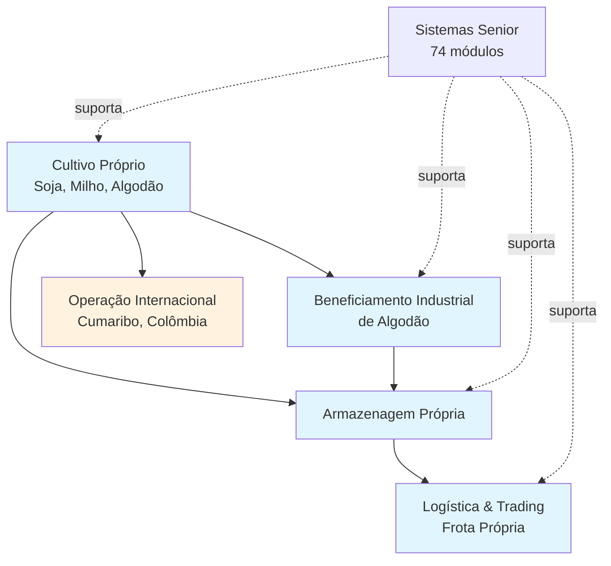
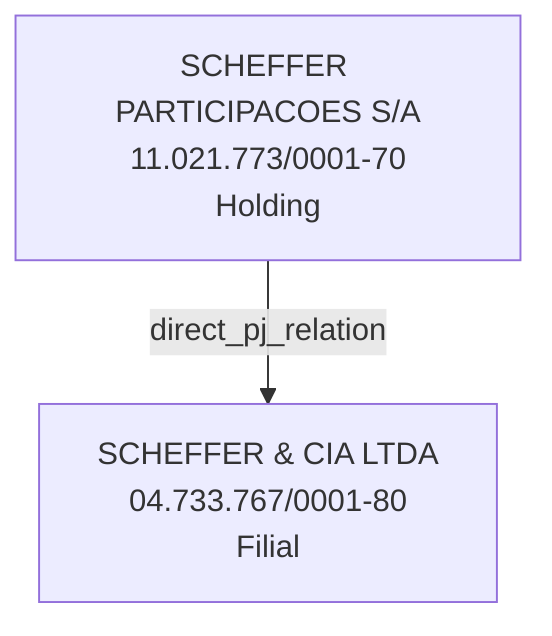

### 1. SÍNTESE EXECUTIVA 🎯
A SCHEFFER & CIA LTDA é uma empresa agrícola verticalizada de grande porte, com operações confirmadas no Brasil e indícios de expansão internacional. Sua estrutura é marcada por uma holding societária e uma operação multiestado robusta.

A empresa atua com **cultivo próprio** de soja, milho e algodão, complementado por **beneficiamento industrial** e logística integrada com frota e armazenagem próprias. 📌 A presença internacional em Cumaribo, Colômbia, é um sinal claro de ambição geográfica.

O parque tecnológico é consolidado em torno da **Senior Sistemas**, com **74 módulos ativos** que suportam desde o ERP até operações específicas como gestão de frota e beneficiamento de algodão via GATec. A governança é familiar, com cinco sócios-administradores ativos.

**Indicadores estimados** apontam para uma operação de escala: **~220-230 mil hectares** e **~2.700 colaboradores**. O faturamento setorial estimado é de **~R$ 1,7 bilhão**. O principal risco reside na complexidade da consolidação entre a matriz brasileira, a holding e a possível filial internacional.

### 2. PERFIL 🏭
A SCHEFFER & CIA LTDA se caracteriza como uma **empresa agrícola verticalizada**. Sua operação abrange desde o cultivo no campo até a logística e o beneficiamento.

**Operação Multiestado e Verticalização**
*   Atuação confirmada nos estados do **Mato Grosso (MT)** e **Maranhão (MA)**. ✅
*   Modelo de negócio integrado: **cultivo → beneficiamento → logística**. ✅
*   **Cultivo próprio** de soja, milho e algodão. ✅
*   **Beneficiamento industrial** de algodão. ✅
*   **Frota própria** para transporte. ✅
*   **Armazenagem própria** para estocagem. ✅

**Expansão e Certificações**
*   **Operação internacional** confirmada em Cumaribo, Colômbia. ✅
*   Portfólio de **certificações** que inclui BCI, regenagri e ABR (ativas). 📌

### 3. ESTRUTURA SOCIETÁRIA 🏛️
A estrutura é centrada na **SCHEFFER & CIA LTDA (Filial)**, que possui uma relação direta com uma holding societária. Não há evidência de que a holding atue operacionalmente.

**Matriz de CNPJs**
| Empresa | CNPJ | Papel |
| :--- | :--- | :--- |
| SCHEFFER & CIA LTDA | 04.733.767/0001-80 | Conta Alvo (Filial) |
| SCHEFFER PARTICIPACOES S/A | 11.021.773/0001-70 | Sócia da Matriz |

**Teia Societária**

*   **Relação Confirmada:** A SCHEFFER PARTICIPACOES S/A é sócia da matriz da SCHEFFER & CIA LTDA. ✅
*   **Governança:** A estrutura de controle é familiar, com cinco sócios-administradores listados no QSA.

### 4. TECNOLOGIA 💻
A empresa possui um **parque tecnológico consolidado e extenso** baseado na plataforma Senior, com foco em gestão operacional agrícola e de negócios.

**Core Tecnológico Confirmado**
*   **Plataforma Principal:** Senior Sistemas.
*   **Escala:** **74 módulos** ativos contratados. ✅
*   **Módulos Críticos Identificados:**
    *   **ERP BackOffice** (Controle financeiro e contábil).
    *   **GATec Agrícola** (Gestão da atividade agrícola).
    *   **GATec - Beneficiamento de Algodão** (Gestão do processo industrial). ✅
    *   **GATec - Gestão da Frota** (Controle da frota própria). ✅
    *   **GATec - Custos e BI** (Análise de desempenho).
    *   **Commerce Trading** (Gestão comercial).
    *   **HCM & Acesso** (Gestão de pessoas e acessos).

**Cobertura e Pontos de Atenção**
*   A solução cobre **operações-chave** confirmadas: cultivo, beneficiamento, frota e armazenagem (via módulo Operis/Balança). ✅
*   **A validar:** Se o módulo **GATec Rastreabilidade** está contratado para atender às exigências das certificações BCI/regenagri/ABR. 🔎
*   **A validar:** Se a **operação colombiana** está integrada ao ERP da matriz brasileira. 🔎
*   **A validar:** Se a **holding SCHEFFER PARTICIPACOES S/A** está no escopo do mesmo ERP. 🔎

### 5. PESSOAS-CHAVE 👥
A governança e operação são dirigidas por um grupo familiar de sócios-administradores, todos confirmados no Quadro Societário Atual (QSA).

**Sócios-Administradores (Confirmados)**
*   **ELIZEU ZULMAR MAGGI SCHEFFER** – Sócio-Administrador.
*   **GUILHERME MOGNON SCHEFFER** – Sócio-Administrador.
*   **GISLAYNE RAFAELA SCHEFFER** – Sócio-Administrador.
*   **GILLIARD ANTONIO SCHEFFER** – Sócio-Administrador.

**Sócia (Confirmada)**
*   **CAROLINA MOGNON SCHEFFER** – Sócia.

**Perfil de Decisão**
A estrutura sugere **decisão concentrada** no núcleo familiar. A presença de múltiplos administradores indica envolvimento direto na gestão operacional e estratégica.

### 6. INDICADORES 📊
Os indicadores apontam para uma empresa de grande escala no agronegócio brasileiro, com números estimados baseados em fontes públicas e setoriais.

**Escala Operacional**
*   **Área Total Estimada:** **220-230 mil hectares** (em duas safras, MT e MA). 📌
*   **Headcount Estimado:** **Aproximadamente 2.700 colaboradores**. 📌

**Adoção Tecnológica**
*   **Módulos de Software Contratados:** **74 módulos Senior** (Confirmado). ✅

**Performance Financeira (Estimativa Setorial)**
*   **Faturamento Consolidado Estimado:** **~R$ 1,7 bilhão**. 🔎

### 7. SINAIS 🚨
Três sinais estratégicos emergem da análise, indicando direções de crescimento e complexidade gerencial.

**Sinal 1 – Internacionalização da Operação**
A confirmação de operação em Cumaribo, Colômbia, vai além de menções de "mercado internacional". Indica **estratégia ativa de expansão geográfica** e adição de complexidade operacional e regulatória.

**Sinal 2 – Verticalização Completa e Certificada**
A posse de certificações como BCI e regenagri, combinada com o controle de toda a cadeia (do cultivo ao beneficiamento), posiciona a empresa para **mercados premium e exigentes**, onde rastreabilidade e sustentabilidade são críticas.

**Sinal 3 – Consolidação Tecnológica com Escopo em Expansão**
Os 74 módulos Senior mostram **investimento pesado em unificação tecnológica**. Os pontos a validar (holding e Colômbia no ERP) sinalizam que o escopo de consolidação financeira e operacional pode estar **se expandindo além das fronteiras legais e nacionais atuais**.

### 8. RISCOS ⚠️
A combinação de expansão internacional, estrutura societária com holding e operação verticalizada gera riscos específicos.

**Risco 1 – Complexidade na Consolidação Financeira**
A existência de uma holding societária (SCHEFFER PARTICIPACOES S/A) e uma operação internacional não confirmada no mesmo ERP gera risco de **processos manuais, erros e falta de visão unificada** do desempenho do grupo.

**Risco 2 – Lacunas na Rastreabilidade da Cadeia**
A ausência de confirmação sobre o módulo de Rastreabilidade do GATec, frente a certificações exigentes (BCI/regenagri), cria um **ponto de fragilidade operacional e de compliance**. A gestão pode estar dependente de sistemas desconectados ou manuais.

**Risco 3 – Sobrecarga do Sistema Atual com Expansão**
A entrada em uma nova fronteira agrícola (Colômbia) pode **sobrecarregar os processos e sistemas atuais**, desenhados para a realidade brasileira. Diferenças climáticas, fiscais e trabalhistas não mapeadas são um vetor de risco.

### 9. PRÓXIMOS PASSOS 🧭
A frente principal de investigação deve ser a **integração e governança do ecossistema empresarial ampliado** (holding, filial BR, operação internacional). As ações buscam validar a arquitetura operacional real.

**1. Validar a Arquitetura de Consolidação Financeira**
*   Qual é o fluxo de consolidação dos resultados entre SCHEFFER & CIA LTDA, SCHEFFER PARTICIPACOES S/A e a operação na Colômbia?
*   A holding possui funcionários ou ativos que demandam gestão separada no ERP?

**2. Esclarecer a Gestão da Rastreabilidade e Conformidade**
*   Como as certificações BCI, regenagri e ABR são gerenciadas hoje?
*   Qual sistema é utilizado para a rastreabilidade do produto desde o campo até o cliente final?

**3. Mapear a Realidade Operacional e Sistemas na Colômbia**
*   A operação de Cumaribo é uma filial legal, um escritório comercial ou um projeto agrícola?
*   Ela utiliza os mesmos sistemas da matriz brasileira (Senior), sistemas locais ou planilhas?